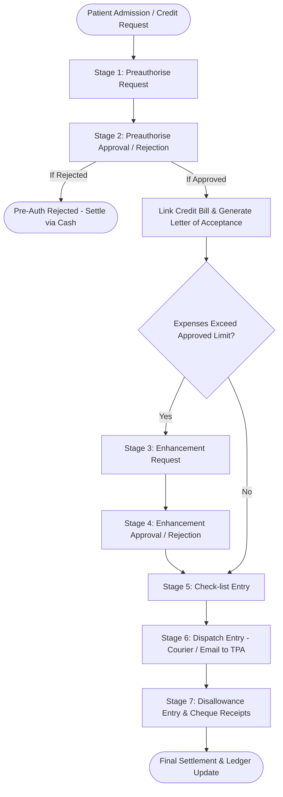

# VITALSOFT (CHARM HEALTH) — COMPLETE INSURANCE MODULE WORKFLOW & TECHNICAL SPECIFICATION

**Application Endpoint**: `http://136.185.1.251:8090/#/insurance`  
**Host Server**: `192.168.1.70`  
**Source Codebase**: `/home/ssb/vitalsoft`  
**Database**: MySQL (`vitalsoft.insurance`)

---

## TABLE OF CONTENTS
1. [Executive Summary & System Architecture](#1-executive-summary--system-architecture)
2. [End-to-End Workflow & Visual Lifecycle](#2-end-to-end-workflow--visual-lifecycle)
3. [Comprehensive 7-Stage Process Specification](#3-comprehensive-7-stage-process-specification)
   - [Stage 1: Preauthorise (Pre-Authorization Request)](#stage-1-preauthorise-pre-authorization-request)
   - [Stage 2: Preauthorise Approval / Rejection](#stage-2-preauthorise-approval--rejection)
   - [Inter-Stage Action: Bill Linking & Letter of Acceptance](#inter-stage-action-bill-linking--letter-of-acceptance)
   - [Stage 3: Enhancement Requested](#stage-3-enhancement-requested)
   - [Stage 4: Enhancement Approval / Rejection](#stage-4-enhancement-approval--rejection)
   - [Stage 5: Check-list Entry](#stage-5-check-list-entry)
   - [Stage 6: Dispatched (Dispatch Entry)](#stage-6-dispatched-dispatch-entry)
   - [Stage 7: Disallowance Entry & Cheque Settlement](#stage-7-disallowance-entry--cheque-settlement)
4. [State Machine & Status Transitions](#4-state-machine--status-transitions)
5. [Database Schema & Entity Model (`vitalsoft.insurance`)](#5-database-schema--entity-model-vitalsoftinsurance)
6. [REST API Endpoints & Request/Response Contracts](#6-rest-api-endpoints--requestresponse-contracts)
7. [Frontend Architecture & UI Interactions](#7-frontend-architecture--ui-interactions)
8. [JasperReports & MIS Analytics Matrix](#8-jasperreports--mis-analytics-matrix)
9. [Print Templates (Letter of Acceptance & Enhancement Request)](#9-print-templates)

---

## 1. EXECUTIVE SUMMARY & SYSTEM ARCHITECTURE

VitalSoft provides a complete, progressive insurance desk workflow managing the lifecycle of an inpatient or outpatient credit claim—from initial pre-authorization request to post-discharge disallowance tracking and bank cheque reconciliation.

```
┌─────────────────────────────────────────────────────────────────────────────┐
│                           VITALSOFT ARCHITECTURE                            │
│                                                                             │
│  FRONTEND: AngularJS 1.x SPA                                               │
│    ├── insurance.js (Module Controller)                                     │
│    ├── index.html (Data Grid, Filters, Search)                              │
│    ├── create.html (Multi-Step Timeline Form & Stage Modals)                │
│    └── billView.html (Credit Bill Selection Modal)                          │
│                                                                             │
│  BACKEND: Spring MVC / Hibernate ORM                                       │
│    ├── InsuranceController.java (/insurance REST endpoints)                 │
│    ├── InsuranceServiceImpl.java (Multipart form parser & state updater)   │
│    ├── InsuranceDaoImpl.java (Hibernate Criteria DB operations)             │
│    └── AttachmentServiceImpl.java (Category-based file management)          │
│                                                                             │
│  DATABASE: MySQL 5.7+ (Database: `vitalsoft`)                              │
│    ├── `insurance` (Main workflow state, audit dates, user IDs)             │
│    ├── `insurance.checklist` (JSON structure for document audit)           │
│    ├── `insurance.cheque_list` (JSON structure for bank receipts)           │
│    ├── `attachment` (Physical files mapped to insurance stage categories)  │
│    └── `bills` / `bill_details` (Linked IP charges & disallowed amounts)   │
└─────────────────────────────────────────────────────────────────────────────┘
```

---

## 2. END-TO-END WORKFLOW & VISUAL LIFECYCLE



---

## 3. COMPREHENSIVE 7-STAGE PROCESS SPECIFICATION

### Stage 1: Preauthorise (Pre-Authorization Request)
- **Status Enum**: `PREAUTHORISATION` (Ordinal: `0`)
- **Backend FormType**: `Preauthorisation`
- **Purpose**: Captures patient policy credentials and sends the first estimate to the TPA.

#### Input Fields & Validation:
1. **Patient Search / Selection**:
   - Fetched dynamically via `/patient/searchPatient?value=...`.
   - Displays Patient No, Full Name, Age, Gender, and Contact No.
2. **Card No**:
   - Patient's Health Insurance Member ID.
   - String, Min: 3, Max: 15 characters.
3. **Card Validity**:
   - Expiration date (`DD/MM/YYYY`).
   - Frontend validation compares `cardValidity` against `todayDate` and renders a warning banner if expired.
4. **Policy No**:
   - Master policy number.
   - String, Min: 3, Max: 15 characters. Required.
5. **PreAuth Type**:
   - Dropdown values: `Regular`, `Emergency`.
   - Default: `Regular`.
6. **Mode of Communication to TPA**:
   - Dropdown values: `Fax`, `Mail`.
   - Default: `Fax`.
7. **Communication Destination**:
   - If `Fax`: **Fax No** input (numeric, 3–15 digits).
   - If `Mail`: **Mail Id** input (email format with regex validation).
8. **Sent for Approval Date & Time**:
   - Combined `preauthAppliedDate` = `preauthDate` + `preauthTime`.
   - Stamped automatically with current date/time unless overridden.
9. **Requested Amount for Approval**:
   - Initial estimated hospitalisation amount in INR (`preauthRequestedAmount`).
10. **Document Attachment**:
    - Scanned copy of Pre-Auth Form, Doctor Admission Advice, ID Card.
    - Category: `preauthorisation`.

---

### Stage 2: Preauthorise Approval / Rejection
- **Status Enum**: `PREAUTHORISATION_APPROVAL` (Ordinal: `1`) or `PREAUTHORISATION_REJECTED` (Ordinal: `2`)
- **Backend FormType**: `PreauthorisationApproval`
- **Purpose**: Records TPA's initial decision, sanctioned amount, and authorization reference number.

#### Input Fields & Validation:
1. **Claim No**:
   - Unique Claim Reference Number issued by the TPA.
   - String, Min: 3, Max: 15 characters. Required.
2. **Approval Status**:
   - Dropdown: `Approved` or `Rejected`. Required.
3. **Date of Approval**:
   - Date & Time picker: `preauthDateOfApproval` = `preauthApproveDate` + `preauthApproveTime`.
4. **Mode of Communication by TPA**:
   - Dropdown: `Fax` or `Mail`.
5. **Communication Endpoint**:
   - Fax No (`preauthApproveFaxNo`) or Mail ID (`preauthApproveMailId`).
6. **Approved Limit**:
   - Approved sanction amount in INR (`preauthApprovedLimit`).
   - Required if `Approval Status == Approved`.
7. **Rejection Reason**:
   - Text explanation (`preauthRejectionReason`).
   - Required if `Approval Status == Rejected`.
8. **Document Attachment**:
   - Upload of Pre-Auth Approval / Denial Letter.
   - Category: `preauthorisationApproval`.

---

### Inter-Stage Action: Bill Linking & Letter of Acceptance
When Stage 2 is **Approved**, two critical operational actions unlock in the UI:

1. **Link Bill (`/mod/insurance_billView`)**:
   - Invokes `GET /bill/currentMonthBill/{patientId}` to fetch unlinked IP credit bills.
   - Selecting a bill invokes `PUT /insurance/updateBillId` linking `bill.id` to the insurance record.
   - Once linked, the bill number, admission date, bed number, and total bill amount are bound to the insurance case.
   - *Enhancement Request is blocked until a Bill is linked.*

2. **Letter of Acceptance (`LETTER_ACCEPTANCE`)**:
   - Triggers direct print template containing patient undertaking:
   > *"With reference to the above, I hereby undertake to pay the amount of my / my ward's hospitalization expenses (includes both medical & non-medical), if the above mentioned Corporate / TPA Company rejects to pay part/full amount to the Hospital."*

---

### Stage 3: Enhancement Requested
- **Status Enum**: `ENHANCEMENT_REQUEST` (Ordinal: `3`)
- **Backend FormType**: `EnhancementRequest`
- **Prerequisite**: Pre-auth must be `Approved` AND an active `Bill` must be linked.
- **Purpose**: Raised during treatment when hospital charges exceed the initial `preauthApprovedLimit`.

#### Input Fields & Validation:
1. **Enhancement Type**:
   - Dropdown: `Regular`, `Emergency`. Default: `Regular`.
2. **Sent for Approval Date & Time**:
   - `enhancementAppliedDate` = `enhancementDate` + `enhancementTime`.
3. **Requested Amount for Enhancement**:
   - Additional / Revised requested limit (`enhancementRequestedAmount`).
4. **Mode of Communication to TPA**:
   - `Fax` or `Mail`.
5. **Destination Fax / Mail**:
   - `enhancementFaxNo` or `enhancementMailId`.
6. **Reason for Enhancement**:
   - Text justification (e.g. extended ICU stay, surgical complications, extra diagnostics).
7. **Billable Services Value Grid**:
   - Live breakdown loaded from `GET /bill/{billId}`.
   - Groups charges by `charge.category.name` and displays total interim amount.
8. **Document Attachment**:
   - Interim bills, investigation reports, doctor case notes.
   - Category: `enhancementRequest`.
9. **Printable Document**:
   - Triggers `ENHANCEMENT_REQUEST` print template detailing patient info, consultant, department, current bill breakdown, and requested amount.

---

### Stage 4: Enhancement Approval / Rejection
- **Status Enum**: `ENHANCEMENT_APPROVAL` (Ordinal: `4`) or `ENHANCEMENT_REJECTED` (Ordinal: `5`)
- **Backend FormType**: `EnhancementApproval`
- **Purpose**: Captures TPA's response for the enhancement request.

#### Input Fields & Validation:
1. **Approval Status**:
   - `Approved` or `Rejected`. Required.
2. **Date of Approval**:
   - `enhancementDateOfApproval` = `enhancementApprovalDate` + `enhancementApproveTime`.
3. **Mode of Communication by TPA**:
   - `Fax` or `Mail`.
4. **Approved Limit**:
   - Revised total approved limit (`enhancementApprovedLimit`).
5. **Rejection Reason**:
   - Populated if enhancement is rejected (`enhancementRejectionReason`).
6. **Document Attachment**:
   - TPA revised authorization letter.
   - Category: `enhancementApproval`.

---

### Stage 5: Check-list Entry
- **Status Enum**: `CHECK_LIST_ENTRY` (Ordinal: `6`)
- **Backend FormType**: `CheckListEntry`
- **Prerequisite**: Enhancement Approval must be `Approved` (or Pre-Auth Approved if no enhancement was needed).
- **Purpose**: Physical and clinical document audit before packing the physical claim docket.

#### Document Checklist Grid (Stored in `insurance.checklist` JSON):
```json
{
  "checklists": [
    {
      "name": "Discharge Summary",
      "toBeSubmit": "1",
      "submitted": "1",
      "nonSubmission": "None"
    },
    {
      "name": "Final Itemised Bill",
      "toBeSubmit": "1",
      "submitted": "1",
      "nonSubmission": "None"
    },
    {
      "name": "Pharmacy Original Receipts",
      "toBeSubmit": "5",
      "submitted": "4",
      "nonSubmission": "1 lost by patient attender"
    }
  ]
}
```

#### Field Details:
- **Document Name**: e.g., Discharge Summary, Final Bill, Investigation Reports, Implant Stickers, OT Notes.
- **To Be Submitted**: Expected count / flag.
- **Submitted**: Actual count verified and enclosed.
- **Reason for Non-Submission**: Free text recording any deficit.
- **Document Attachment**: Full signed checklist docket (Category: `checkListEntry`).

---

### Stage 6: Dispatched (Dispatch Entry)
- **Status Enum**: `DISPATCH_ENTRY` (Ordinal: `8`)
- **Backend FormType**: `DispatchEntry`
- **Purpose**: Records physical handover or electronic transmission of the completed claim packet to the TPA / Insurer.

#### Input Fields:
1. **Date of Dispatch**:
   - `dispatchDateTime` = `dispatchDate` + `dispatchTime`.
2. **Mode of Dispatch**:
   - Dropdown: `Courier` or `Email`.
3. **Courier Company** (if Mode = Courier):
   - Dropdown enum (`Couriers`):
     - `Profession_Courier`
     - `First_Flight`
     - `ST_Courier`
     - `DTDC`
     - `Blue_Dart`
4. **POD No (Proof of Delivery / Consignment Number)**:
   - Courier tracking barcode / consignment number.
5. **Dispatched By**:
   - Name of hospital billing / dispatch executive.
6. **Dispatch Mail ID** (if Mode = Email):
   - Destination TPA claims processing email.
7. **Reason for Delay**:
   - Mandatory note if dispatch occurred beyond agreed hospital TAT.

---

### Stage 7: Disallowance Entry & Cheque Settlement
- **Status Enum**: `DISALLOWANCE_ENTRY` (Ordinal: `7`)
- **Backend FormType**: `DisallowanceEntry`
- **Purpose**: Final settlement tracking after insurer remittance. Records received bank cheques and itemized deduction/disallowance deductions against bill charges.

#### 1. Cheque / Payment Receipts Grid (Stored in `insurance.cheque_list` JSON):
```json
{
  "chequeLists": [
    {
      "chequeNo": "CHQ-981245",
      "date": "15/08/2026",
      "drawnOn": "HDFC Bank",
      "payableAt": "Anna Nagar Branch",
      "amount": "85000",
      "authorised": "TPA Claims Officer"
    }
  ]
}
```
- **Cheque / UTR No**: Cheque or NEFT/RTGS transaction reference.
- **Date**: Cheque clearance / transfer date.
- **Drawn On**: Bank issuing the payment.
- **Payable At**: Issuing branch.
- **Amount**: Net INR disbursed.
- **Authorised**: Authorizing signatory / officer.

#### 2. Itemised Disallowance Deduction Tracking:
- **View Toggle**:
  - `Bill`: Summary table grouped by `charge.category.name`, showing Category Name, Total Category Amount, and Total Disallowed Amount.
  - `Details`: Line-item breakdown listing each individual charge (e.g. Bed Charges, Doctor Visit, Investigation, Consumables) with its billed amount and an editable `disallowedAmount` input.
- **Action**: Updating disallowance invokes `PUT /bill/updateBillDetails`, writing `disallowedAmount` directly to the `bill_details` table for hospital financial accounting.

---

## 4. STATE MACHINE & STATUS TRANSITIONS

### `InsuranceCurrentStatus` (Enum Ordinal Mapping)

| Ordinal | Enum Value | Display Label | Next Allowed Stages |
| :---: | :--- | :--- | :--- |
| `0` | `PREAUTHORISATION` | Preauthorise | `PREAUTHORISATION_APPROVAL`, `PREAUTHORISATION_REJECTED` |
| `1` | `PREAUTHORISATION_APPROVAL` | Preauthorise Approval | `ENHANCEMENT_REQUEST`, `CHECK_LIST_ENTRY` |
| `2` | `PREAUTHORISATION_REJECTED` | Preauthorise Rejected | *Terminal / Cash Conversion* |
| `3` | `ENHANCEMENT_REQUEST` | Enhancement Requested | `ENHANCEMENT_APPROVAL`, `ENHANCEMENT_REJECTED` |
| `4` | `ENHANCEMENT_APPROVAL` | Enhancement Approval | `CHECK_LIST_ENTRY` |
| `5` | `ENHANCEMENT_REJECTED` | Enhancement Rejected | `CHECK_LIST_ENTRY` (with pre-auth limit) |
| `6` | `CHECK_LIST_ENTRY` | Check-list Entry | `DISPATCH_ENTRY` |
| `7` | `DISALLOWANCE_ENTRY` | Disallowance Entry | *Final Settlement Complete* |
| `8` | `DISPATCH_ENTRY` | Dispatched | `DISALLOWANCE_ENTRY` |

```
Status Transition Rule:
In `InsuranceServiceImpl.java`, the status progresses strictly monotonically:
existingStatus.ordinal() < newStatus.ordinal() ? newStatus : existingStatus
(Ensures historical stage completion is preserved if earlier stages are reviewed).
```

---

## 5. DATABASE SCHEMA & ENTITY MODEL (`vitalsoft.insurance`)

```sql
CREATE TABLE `insurance` (
  `id` BINARY(16) NOT NULL,
  `patient` BINARY(16) DEFAULT NULL,
  `bill` BINARY(16) DEFAULT NULL,
  `card_no` VARCHAR(255) DEFAULT NULL,
  `card_validity` DATETIME DEFAULT NULL,
  `policy_no` VARCHAR(255) DEFAULT NULL,
  
  -- Stage 1: Preauthorisation Request
  `preauth_type` INT(11) DEFAULT NULL,               -- 0: Regular, 1: Emergency
  `preauth_applied_date` DATETIME DEFAULT NULL,
  `preauth_communication_to_tpa` INT(11) DEFAULT NULL,-- 0: Fax, 1: Mail
  `preauth_fax_no` VARCHAR(255) DEFAULT NULL,
  `preauth_mail_id` VARCHAR(255) DEFAULT NULL,
  `preauth_requested_amount` INT(11) DEFAULT NULL,
  `preauth_created_by` BINARY(16) DEFAULT NULL,
  `preauth_created_date` DATETIME DEFAULT NULL,
  `preauth_updated_by` BINARY(16) DEFAULT NULL,
  `preauth_updated_date` DATETIME DEFAULT NULL,
  
  -- Stage 2: Preauthorisation Approval
  `claim_no` VARCHAR(255) DEFAULT NULL,
  `preauth_approval_status` INT(11) DEFAULT NULL,     -- 0: Approved, 1: Rejected
  `preauth_date_of_approval` DATETIME DEFAULT NULL,
  `preauth_communication_by_tpa` INT(11) DEFAULT NULL,
  `preauth__approval_fax_no` VARCHAR(255) DEFAULT NULL,
  `preauth__approval_mail_id` VARCHAR(255) DEFAULT NULL,
  `preauth_approved_limit` INT(11) DEFAULT NULL,
  `preauth_rejection_reason` VARCHAR(255) DEFAULT NULL,
  `preauth_approval_created_by` BINARY(16) DEFAULT NULL,
  `preauth_approval_created_date` DATETIME DEFAULT NULL,
  `preauth_approval_updated_by` BINARY(16) DEFAULT NULL,
  `preauth_approval_updated_date` DATETIME DEFAULT NULL,

  -- Stage 3: Enhancement Request
  `enhancement_type` INT(11) DEFAULT NULL,
  `enhancement_applied_date` DATETIME DEFAULT NULL,
  `enhancement_communication_to_tpa` INT(11) DEFAULT NULL,
  `enhancement_fax_no` VARCHAR(255) DEFAULT NULL,
  `enhancement_mail_id` VARCHAR(255) DEFAULT NULL,
  `enhancement_requested_amount` INT(11) DEFAULT NULL,
  `reason_for_enhancement` VARCHAR(255) DEFAULT NULL,
  `enhancement_created_by` BINARY(16) DEFAULT NULL,
  `enhancement_created_date` DATETIME DEFAULT NULL,
  `enhancement_updated_by` BINARY(16) DEFAULT NULL,
  `enhancement_updated_date` DATETIME DEFAULT NULL,

  -- Stage 4: Enhancement Approval
  `enhancement_approval_status` INT(11) DEFAULT NULL,
  `enhancement_date_of_approval` DATETIME DEFAULT NULL,
  `enhancement_communication_by_tpa` INT(11) DEFAULT NULL,
  `enhancement_approved_limit` INT(11) DEFAULT NULL,
  `enhancement_rejection_reason` VARCHAR(255) DEFAULT NULL,
  `enhancement_approval_created_by` BINARY(16) DEFAULT NULL,
  `enhancement_approval_created_date` DATETIME DEFAULT NULL,
  `enhancement_approval_updated_by` BINARY(16) DEFAULT NULL,
  `enhancement_approval_updated_date` DATETIME DEFAULT NULL,

  -- Stage 5: Checklist
  `checklist` JSON DEFAULT NULL,
  `check_list_created_by` BINARY(16) DEFAULT NULL,
  `check_list_created_date` DATETIME DEFAULT NULL,
  `check_list_updated_by` BINARY(16) DEFAULT NULL,
  `check_list_updated_date` DATETIME DEFAULT NULL,

  -- Stage 6: Dispatch
  `mode_of_dispatch` INT(11) DEFAULT NULL,            -- 0: Email, 1: Courier
  `courier` INT(11) DEFAULT NULL,                    -- 0: Profession, 1: First_Flight, 2: ST, 3: DTDC, 4: Blue_Dart
  `dispatch_date` DATETIME DEFAULT NULL,
  `dispatched_by` VARCHAR(255) DEFAULT NULL,
  `dispatch_mail_id` VARCHAR(255) DEFAULT NULL,
  `pod_no` VARCHAR(255) DEFAULT NULL,
  `reason_for_delay` VARCHAR(255) DEFAULT NULL,
  `dispatch_created_by` BINARY(16) DEFAULT NULL,
  `dispatch_created_date` DATETIME DEFAULT NULL,

  -- Stage 7: Disallowance & Settlement
  `cheque_list` JSON DEFAULT NULL,
  `disallowance_created_by` BINARY(16) DEFAULT NULL,
  `disallowance_created_date` DATETIME DEFAULT NULL,

  -- Current Stage Status (0 to 8)
  `insurance_current_status` INT(11) DEFAULT NULL,
  
  PRIMARY KEY (`id`),
  KEY `fk_ins_patient` (`patient`),
  KEY `fk_ins_bill` (`bill`),
  CONSTRAINT `fk_ins_patient` FOREIGN KEY (`patient`) REFERENCES `patients` (`id`),
  CONSTRAINT `fk_ins_bill` FOREIGN KEY (`bill`) REFERENCES `bills` (`id`)
) ENGINE=InnoDB DEFAULT CHARSET=utf8;
```

---

## 6. REST API ENDPOINTS & REQUEST/RESPONSE CONTRACTS

### 1. `GET /insurance?searchFromDate={startDate}&searchToDate={endDate}`
- **Description**: Retrieves all insurance cases created within the specified date range.
- **Response**: Array of `Insurance` entities with linked `patient` and `bill`.

### 2. `POST /insurance`
- **Description**: Creates or updates an insurance stage.
- **Content-Type**: `multipart/form-data`
  - `insurance`: JSON Blob of `InsuranceDto` (including `formType`).
  - `file`: Optional binary attachment.
- **Response**:
```json
{
  "message": "Insurance information Saved/Updated successfully",
  "data": {
    "id": "583b3a3e-e8fe-4834-8ac3-fa0c4686ac08",
    "cardNo": "8888888",
    "policyNo": "8888888",
    "insuranceCurrentStatus": "PREAUTHORISATION_APPROVAL",
    "preauthApprovedLimit": 100000
  }
}
```

### 3. `PUT /insurance/updateBillId`
- **Description**: Binds a patient credit bill to the insurance file.
- **Payload**:
```json
{
  "id": "583b3a3e-e8fe-4834-8ac3-fa0c4686ac08",
  "bill": {
    "id": "c1f92e44-1234-5678-9abc-def012345678"
  }
}
```
- **Response**: `{ "message": "Bill Liked successfully", "data": { ... } }`

### 4. `GET /insurance/preAuthType`
- **Response**: `["Regular", "Emergency"]`

### 5. `GET /insurance/modeOfCommunication`
- **Response**: `["Fax", "Mail"]`

### 6. `GET /insurance/insuranceStatus`
- **Response**: `["Approved", "Rejected"]`

### 7. `GET /insurance/getStatus`
- **Response**: `[{"id": "0", "name": "Approved"}, {"id": "1", "name": "Rejected"}]`

### 8. `GET /insurance/getAgeingCriteria`
- **Response**:
```json
[
  {"id": "1", "name": "Less than 31 days"},
  {"id": "2", "name": "31 to 60 days"},
  {"id": "3", "name": "61 to 90 days"},
  {"id": "4", "name": "91 to 120 days"},
  {"id": "5", "name": "121 to 150 days"},
  {"id": "6", "name": "More than 150 days"}
]
```

### 9. `GET /attachment/{insuranceId}?attachmentType=Insurance&attachmentCategory={category}`
- **Categories**: `preauthorisation`, `preauthorisationApproval`, `enhancementRequest`, `enhancementApproval`, `checkListEntry`.
- **Response**: `List<Attachment>` with `id`, `fileName`, `contentType`, `createdDate`.

### 10. `GET /bill/currentMonthBill/{patientId}`
- **Description**: Returns all unlinked credit bills generated in the current month for the patient.

### 11. `PUT /bill/updateBillDetails`
- **Description**: Batch updates the `disallowedAmount` on individual bill detail items.

---

## 7. FRONTEND ARCHITECTURE & UI INTERACTIONS

### Main Insurance List View (`index.html`)
- **Date Range Picker**: Defaulted to current day (`searchFromDate` to `searchToDate`).
- **Patient Live Search**: Filters grid by Patient Name or MRN/Patient No.
- **Stage Status Filter Dropdown**: Filter by All, `Preauthorisation`, `Preauthorisation_approval`, `Enhancement_request`, `Enhancement_approval`.
- **Grid Summary Columns**:
  1. `S.No`
  2. `Patient No`
  3. `Patient Name`
  4. `TPA / Mode`
  5. `Approved Amount` (Pre-auth / Enhancement limit)
  6. `Bill Amount` (from linked Bill)
  7. `Status` (`insuranceCurrentStatus`)
  8. `Action` (Chevron button opening modal view)

### Multi-Step Timeline Modal (`create.html`)
- The left sidebar displays an interactive vertical timeline with dynamic circle/step lines:
  - Active step highlighted with breadcrumb arrow (`triangle-left`).
  - Completed steps display their timestamp (`createdDate`).
  - Clicking any unlocked step navigates directly to that stage's details.
- Edit mode toggles: Clicking the pencil icon unlocks inputs for update.
- Attachment box on each stage: Displays uploaded files with Download (`fa-arrow-down`) and Delete (`fa-times`) buttons.

---

## 8. JASPERREPORTS & MIS ANALYTICS MATRIX

Located under `/home/ssb/vitalsoft/application/src/main/reports/insurance/`:

| Report Title | Template Name | Parameters | Business Purpose |
| :--- | :--- | :--- | :--- |
| **Pre-Authorisation Raised** | `PreAuth_Raised.jrxml` | Date Range, TPA | Log of all initial pre-auth requests submitted. |
| **Pre-Authorisation Status** | `PreAuth_Status.jrxml` | Date Range, Status | Consolidated status with sub-reports: `PreAuth_Status_Approved`, `PreAuth_Status_InProcess`, `PreAuth_Status_Rejected`. |
| **Enhancement Raised** | `Enhancement_Raised.jrxml` | Date Range, TPA | Audit of all interim enhancement requests. |
| **Enhancement Status** | `Enhancement_Status.jrxml` | Date Range, Status | Sub-reports: `Enhance_Status_Approved`, `Enhance_Status_InProcess`, `Enhance_Status_Rejected`. |
| **Claim Dispatch** | `Claim_Dispatch.jrxml` | Date Range, Courier | Consignment report of physical claim packets, courier names & POD numbers. |
| **Disallowance Summary** | `Disallowance_Summary.jrxml` | Date Range, Payer | Payer-wise summary of billed charges vs disallowed deductions. |
| **Disallowance Detail** | `Disallowance_Detail.jrxml` | Date Range, Patient | Charge-by-charge audit of hospital deductions. |
| **Document Pending Status** | `Document_Pending_Status.jrxml` | Date Range | Blocked claims waiting on missing documents/checklists. |
| **IP Outstanding Credit Bills** | `Outstanding_IP_Bills.jrxml` | As on Date | Open credit bills pending settlement from insurance companies. |
| **Ageing Analysis** | `Ageing_Analysis.jrxml` | Ageing Bracket (1–6) | Receivables bucketed into <31d, 31-60d, 61-90d, 91-120d, 121-150d, >150d. |

---

## 9. PRINT TEMPLATES

### 1. Letter of Acceptance (`LETTER_ACCEPTANCE`)
- **Trigger**: Clicked from Stage 2 (Preauthorise Approval).
- **Content**: Formatted patient undertaking acknowledging insurance coverage limit and guaranteeing direct settlement of any non-sanctioned medical or non-medical charges.

### 2. Enhancement Request (`ENHANCEMENT_REQUEST`)
- **Trigger**: Clicked from Stage 3 (Enhancement Request).
- **Content**: Formal hospital requisition sent to TPA containing patient demographics, primary consultant, department, current bill itemization by service category, previously sanctioned limit, and new requested enhancement amount with clinical justification.
