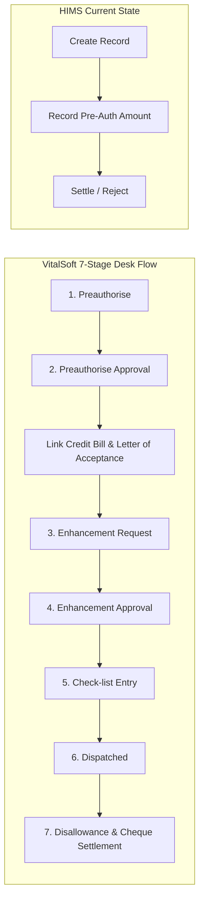

# VITALSOFT VS. HIMS — INSURANCE MODULE GAP ANALYSIS & REMEDIATION SPECIFICATION

**Document Version**: 1.0  
**Target Codebase**: `HIMS-Clinical-multi-tenant-data-encrypted`  
**Reference System**: VitalSoft (`192.168.1.70:8090`)  
**Date**: August 15, 2026

---

## TABLE OF CONTENTS
1. [Executive Summary](#1-executive-summary)
2. [Functional Workflow Gaps (Stage by Stage)](#2-functional-workflow-gaps-stage-by-stage)
   - [Stage 1: Preauthorise Request](#stage-1-preauthorise-request)
   - [Stage 2: Preauthorise Approval / Rejection](#stage-2-preauthorise-approval--rejection)
   - [Inter-Stage Action: Link Bill & Letter of Acceptance](#inter-stage-action-link-bill--letter-of-acceptance)
   - [Stage 3: Enhancement Requested](#stage-3-enhancement-requested)
   - [Stage 4: Enhancement Approval / Rejection](#stage-4-enhancement-approval--rejection)
   - [Stage 5: Check-list Entry (Pre-Dispatch Audit)](#stage-5-check-list-entry-pre-dispatch-audit)
   - [Stage 6: Dispatched (Dispatch Entry)](#stage-6-dispatched-dispatch-entry)
   - [Stage 7: Disallowance Entry & Cheque Settlement](#stage-7-disallowance-entry--cheque-settlement)
3. [Comprehensive Reporting & MIS Analytics Gaps (10 Reports)](#3-comprehensive-reporting--mis-analytics-gaps-10-reports)
4. [Database & Schema Gaps (`insurances` Table)](#4-database--schema-gaps-insurances-table)
5. [Frontend Architecture & UI/UX Gaps](#5-frontend-architecture--uiux-gaps)
6. [API Contract Gaps](#6-api-contract-gaps)
7. [Step-by-Step Implementation & Remediation Roadmap](#7-step-by-step-implementation--remediation-roadmap)

---

## 1. EXECUTIVE SUMMARY

The HIMS application has recently incorporated modern digital National Health Claims Exchange (NHCX/FHIR) services (`/preauth`, `/policy`, `/insurance/claims`), but **lacks the manual, progressive 7-stage desk flow and reporting engine** that operational hospital insurance desks rely on for traditional TPA/private insurer interactions.

### High-Level Comparison:
```
┌───────────────────────────────────────────────┬───────────────────────────────┬───────────────────────────────┐
│ Feature Category                              │ VitalSoft (Reference)         │ HIMS (Current)                │
├───────────────────────────────────────────────┼───────────────────────────────┼───────────────────────────────┤
│ UI Workflow Architecture                      │ 7-Stage Progressive Timeline  │ Flat Single-Step Table & Modal│
│ Card Expiry Validation                        │ Real-time comparison to today │ ❌ Missing                    │
│ TPA Communication Channels (Fax/Mail)         │ Strict validation & fields    │ ❌ Generic string only        │
│ TPA Claim Number Tracking                     │ First-class entity field      │ ❌ Missing (`claimNo`)        │
│ Bill Linking Modal                            │ Dynamic Credit Bill Picker    │ ❌ Frontend UI Missing        │
│ Letter of Acceptance Requisition              │ Direct Jade/HTML Print Engine │ ❌ Missing in Insurance Desk  │
│ Mid-Stay Enhancement Requisition & Approval   │ Live bill breakdown + Print   │ ❌ Missing in Insurance Desk  │
│ Pre-Dispatch Document Checklist               │ Dynamic JSON table + Audit    │ ❌ Completely Missing         │
│ Courier & Dispatch Tracking                   │ Courier vendor + POD tracking │ ❌ Completely Missing         │
│ Itemized Charge Disallowances                 │ Charge-by-charge deduction UI │ ❌ Frontend Grid Missing      │
│ Physical Cheque / Remittance Tracking         │ Cheque grid (bank, branch, no)│ ❌ Missing in Insurance Desk  │
│ Insurance Reports Subsystem                   │ 10 JasperReports (.jrxml)     │ ❌ Missing 9 out of 10 reports│
└───────────────────────────────────────────────┴───────────────────────────────┴───────────────────────────────┘
```

---

## 2. FUNCTIONAL WORKFLOW GAPS (STAGE BY STAGE)



---

### Stage 1: Preauthorise Request

| Feature / Requirement | VitalSoft (Reference) | HIMS Current | Implementation Gap |
| :--- | :--- | :--- | :--- |
| **Card Validity Expiry Alert** | Calculates `cardValidity < todayDate` and highlights in red/amber with a warning banner. | Raw date picker only; no expiration check. | **High**: Desk can admit patients with expired insurance cards. |
| **Mode of Communication to TPA** | Dropdown: `Fax`, `Mail`. | Free-text string or missing enum. | **Medium**: Lacks structured communication categorization. |
| **Conditional TPA Endpoints** | If `Fax`: validates 3–15 digit Fax No.<br>If `Mail`: validates email pattern. | Single unstructured `communication` field. | **High**: Cannot capture verified contact endpoints for transmission. |
| **Sent Date & Time** | Separate date & time controls stored as `preauth_applied_date` timestamp. | Single `pre_auth_date` (Date only). | **Low**: Time of submission is lost for SLA tracking. |
| **Pre-Auth Attachments** | Category: `preauthorisation` with download & delete actions. | No attachment support on insurance creation. | **High**: Scanned doctor advice, ID proofs, and pre-auth forms cannot be attached. |

---

### Stage 2: Preauthorise Approval / Rejection

| Feature / Requirement | VitalSoft (Reference) | HIMS Current | Implementation Gap |
| :--- | :--- | :--- | :--- |
| **TPA Claim Number** | Mandatory input `claimNo` (3–15 chars) separate from policy/preauth number. | Only has `pre_auth_number`. | **High**: TPA's internal claim docket number cannot be recorded. |
| **Communication Channel by TPA** | Dropdown (`Fax` / `Mail`) + `preauthApproveFaxNo` / `preauthApproveMailId`. | Not tracked. | **Medium**: No audit trail of how TPA transmitted approval. |
| **Approval Document Attachment** | Category: `preauthorisationApproval` file upload. | No file attachment in modal. | **High**: Official TPA sanction letter is not stored against the record. |

---

### Inter-Stage Action: Link Bill & Letter of Acceptance

| Feature / Requirement | VitalSoft (Reference) | HIMS Current | Implementation Gap |
| :--- | :--- | :--- | :--- |
| **Link Credit Bill Modal** | `GET /bill/currentMonthBill/{patientId}` lists active IP credit bills; user clicks "Select" to link `bill_id`. | Backend has `/insurance/updateBillId`, but **no UI button/modal exists in frontend**. | **Critical**: Insurance file cannot be bound to the patient's actual hospital bill. |
| **Enhancement Pre-requisite Rule** | UI disables Enhancement Request and shows `Please Link the bill` warning if `bill == null`. | No validation. | **High**: Enhancements can be submitted without billing context. |
| **Letter of Acceptance** | Direct print action generating `LETTER_ACCEPTANCE` undertaking signed by patient/attender. | No print template available in Insurance module. | **Critical**: Hospital has no signed undertaking from the patient for non-medical expenses. |

---

### Stage 3: Enhancement Requested

| Feature / Requirement | VitalSoft (Reference) | HIMS Current | Implementation Gap |
| :--- | :--- | :--- | :--- |
| **Enhancement Desk UI** | Dedicated stage form in sidebar timeline modal. | Missing in `InsurancePage.tsx`. | **Critical**: No UI for manual TPA enhancement requests. |
| **Live Billable Services View** | Embedded table displaying running hospital bill grouped by service category (Room, Diagnostics, Pharmacy, Surgery). | Missing in Insurance module. | **High**: Staff must switch between Billing and Insurance pages to check charges. |
| **Reason for Enhancement** | Mandatory text justification (`reasonForEnhancement`). | Missing in `Insurance` model. | **Medium**: Reason for exceeding pre-auth limit is unrecorded. |
| **Enhancement Request Print** | Direct print action generating `ENHANCEMENT_REQUEST` formal hospital requisition docket. | Missing print template. | **High**: Formal enhancement docket cannot be printed for fax/email. |

---

### Stage 4: Enhancement Approval / Rejection

| Feature / Requirement | VitalSoft (Reference) | HIMS Current | Implementation Gap |
| :--- | :--- | :--- | :--- |
| **Enhancement Approval Form** | Captures `enhancementApprovedLimit`, `enhancementApprovalStatus`, and approval timestamp. | Missing in `Insurance` model. | **Critical**: Revised approved limit cannot be stored; overwriting pre-auth limit loses audit history. |
| **Revised Sanction Attachment** | Category: `enhancementApproval` upload. | Missing. | **High**: Revised TPA approval letter cannot be attached. |

---

### Stage 5: Check-list Entry (Pre-Dispatch Document Audit)

| Feature / Requirement | VitalSoft (Reference) | HIMS Current | Implementation Gap |
| :--- | :--- | :--- | :--- |
| **Checklist Table Grid** | Interactive table with: Document Name, To Be Submitted (count), Submitted (count), Non-Submission Reason. | Completely Missing. | **Critical**: Hospital dispatch staff have no checklist to audit physical documents before courier. |
| **JSON Storage Model** | Stored in `insurance.checklist` JSON (`checklists: [...]`). | No `checklist` column in `insurances`. | **High**: Schema gap. |
| **Signed Checklist Attachment** | Category: `checkListEntry` docket upload. | Missing. | **Medium**: Scanned physical checklist is untracked. |

---

### Stage 6: Dispatched (Dispatch Entry)

| Feature / Requirement | VitalSoft (Reference) | HIMS Current | Implementation Gap |
| :--- | :--- | :--- | :--- |
| **Mode of Dispatch** | Dropdown: `Courier` or `Email`. | Completely Missing. | **Critical**: No outward dispatch tracking. |
| **Courier Vendor Selection** | Select from: `Profession_Courier`, `First_Flight`, `ST_Courier`, `DTDC`, `Blue_Dart`. | Completely Missing. | **High**: Logistics partner is untracked. |
| **POD Tracking Number** | Courier consignment tracking number (`pod_no`). | Completely Missing. | **Critical**: Cannot prove physical delivery to TPA in case of lost claims. |
| **Dispatched By & Delay Reason**| Staff name (`dispatchedBy`) and justification (`reasonForDelay`) if delayed past TAT. | Completely Missing. | **Medium**: Operational delay auditing missing. |

---

### Stage 7: Disallowance Entry & Cheque Settlement

| Feature / Requirement | VitalSoft (Reference) | HIMS Current | Implementation Gap |
| :--- | :--- | :--- | :--- |
| **Cheque Receipts Grid** | Table capturing: Cheque/UTR No, Cheque Date, Drawn On (Bank), Payable At (Branch), Amount, Authorised By. | Missing in Insurance desk. | **Critical**: Physical cheque/RTGS payments from TPAs cannot be recorded. |
| **Cheque JSON Storage** | Stored in `insurance.cheque_list` JSON (`chequeLists: [...]`). | No `cheque_list` column in `insurances`. | **High**: Schema gap. |
| **Itemized Disallowance Deductions**| Category ("Bill") and Charge-level ("Details") grid allowing staff to input `disallowedAmount` per line item. | Backend has `charge_line_items.disallowed_amount`, but **frontend has no deduction UI**. | **Critical**: Cannot record specific disallowed services (e.g., non-covered drugs, room rent excess). |
| **Bill Details Disallowance Sync** | Automatically syncs deductions to `bill_details` via `PUT /bill/updateBillDetails`. | Not wired to Insurance UI. | **High**: Billed vs Realized gap remains unsynced on the patient's bill. |

---

## 3. COMPREHENSIVE REPORTING & MIS ANALYTICS GAPS (10 REPORTS)

In HIMS, `InsuranceReportsTab.tsx` only renders **1 generic count card** (`insurance_summary`) with no backend data service. In contrast, VitalSoft provides **10 dedicated JasperReports**:

```
┌──────────────────────────────────────────────────────────────────────────────────────────────────┐
│                                   INSURANCE REPORTS MATRIX                                       │
├────┬─────────────────────────────┬─────────────────────────────────┬─────────────────────────────┤
│ #  │ Report Name                 │ VitalSoft Query & Purpose       │ HIMS Status & Action Needed │
├────┼─────────────────────────────┼─────────────────────────────────┼─────────────────────────────┤
│ 1  │ Pre-Authorisation Raised    │ Date range audit of all initial │ ❌ Missing                  │
│    │ (`PreAuth_Raised.jrxml`)    │ requests, requested amounts, TPA│ Build DataService & Report  │
├────┼─────────────────────────────┼─────────────────────────────────┼─────────────────────────────┤
│ 2  │ Pre-Authorisation Status    │ Consolidated report with 3 sub- │ ❌ Missing                  │
│    │ (`PreAuth_Status.jrxml`)    │ reports: Approved, InProcess,   │ Build Multi-Tab Report      │
│    │                             │ and Rejected pre-auths.         │                             │
├────┼─────────────────────────────┼─────────────────────────────────┼─────────────────────────────┤
│ 3  │ Enhancement Raised          │ Date range audit of all mid-    │ ❌ Missing                  │
│    │ (`Enhancement_Raised.jrxml`)| admission enhancement requests. │ Build DataService & Report  │
├────┼─────────────────────────────┼─────────────────────────────────┼─────────────────────────────┤
│ 4  │ Enhancement Status          │ Status breakdown: Enhance       │ ❌ Missing                  │
│    │ (`Enhancement_Status.jrxml`)| Approved, InProcess, Rejected.  │ Build Multi-Tab Report      │
├────┼─────────────────────────────┼─────────────────────────────────┼─────────────────────────────┤
│ 5  │ Claim Dispatch Report       │ Consignment audit with courier  │ ❌ Missing                  │
│    │ (`Claim_Dispatch.jrxml`)    │ names, POD numbers & dates.     │ Build Dispatch Log Report   │
├────┼─────────────────────────────┼─────────────────────────────────┼─────────────────────────────┤
│ 6  │ Disallowance Summary        │ Payer-wise summary of billed    │ ❌ Missing                  │
│    │ (`Disallowance_Summary`)    │ amounts vs disallowed amounts.  │ Build Summary Report        │
├────┼─────────────────────────────┼─────────────────────────────────┼─────────────────────────────┤
│ 7  │ Disallowance Detail         │ Charge-by-charge line item      │ ❌ Missing                  │
│    │ (`Disallowance_Detail`)     │ deduction audit across bills.   │ Build Itemized Deduction Rep│
├────┼─────────────────────────────┼─────────────────────────────────┼─────────────────────────────┤
│ 8  │ Document Pending Status     │ Worklist of claims blocked at   │ ❌ Missing                  │
│    │ (`Document_Pending_Status`) │ checklist/document audit stage. │ Build Operational Report    │
├────┼─────────────────────────────┼─────────────────────────────────┼─────────────────────────────┤
│ 9  │ IP Outstanding Credit Bills │ Open credit bills awaiting      │ ❌ Missing                  │
│    │ (`Outstanding_IP_Bills`)    │ insurance settlement.           │ Build AR Aging Report       │
├────┼─────────────────────────────┼─────────────────────────────────┼─────────────────────────────┤
│ 10 │ Ageing Analysis Report      │ Receivables bucketed: <31d,     │ ❌ Missing                  │
│    │ (`Ageing_Analysis.jrxml`)   │ 31-60d, 61-90d, 91-120d, >150d. │ Build Aging Bracket Report  │
└────┴─────────────────────────────┴─────────────────────────────────┴─────────────────────────────┘
```

---

## 4. DATABASE & SCHEMA GAPS (`insurances` TABLE)

To support the complete flow, the following schema additions are required in HIMS database migrations:

```sql
-- Migration: V197__complete_insurance_workflow_fields.sql

ALTER TABLE insurances
    -- Stage 1: Pre-Auth Request Enhancements
    ADD COLUMN IF NOT EXISTS card_validity                  DATE,
    ADD COLUMN IF NOT EXISTS preauth_communication_to_tpa   VARCHAR(40),
    ADD COLUMN IF NOT EXISTS preauth_fax_no                 VARCHAR(80),
    ADD COLUMN IF NOT EXISTS preauth_mail_id                VARCHAR(150),
    ADD COLUMN IF NOT EXISTS preauth_created_by             UUID,
    ADD COLUMN IF NOT EXISTS preauth_created_date           TIMESTAMPTZ,
    ADD COLUMN IF NOT EXISTS preauth_updated_by             UUID,
    ADD COLUMN IF NOT EXISTS preauth_updated_date           TIMESTAMPTZ,

    -- Stage 2: Pre-Auth Approval Enhancements
    ADD COLUMN IF NOT EXISTS claim_no                       VARCHAR(255),
    ADD COLUMN IF NOT EXISTS preauth_communication_by_tpa   VARCHAR(40),
    ADD COLUMN IF NOT EXISTS preauth_approve_fax_no         VARCHAR(80),
    ADD COLUMN IF NOT EXISTS preauth_approve_mail_id        VARCHAR(150),
    ADD COLUMN IF NOT EXISTS preauth_approved_limit         BIGINT,
    ADD COLUMN IF NOT EXISTS preauth_approval_created_by    UUID,
    ADD COLUMN IF NOT EXISTS preauth_approval_created_date  TIMESTAMPTZ,
    ADD COLUMN IF NOT EXISTS preauth_approval_updated_by    UUID,
    ADD COLUMN IF NOT EXISTS preauth_approval_updated_date  TIMESTAMPTZ,

    -- Stage 3 & 4: Enhancement Request & Approval
    ADD COLUMN IF NOT EXISTS enhancement_type               VARCHAR(40),
    ADD COLUMN IF NOT EXISTS enhancement_applied_date       TIMESTAMPTZ,
    ADD COLUMN IF NOT EXISTS enhancement_requested_amount   BIGINT,
    ADD COLUMN IF NOT EXISTS enhancement_communication_to_tpa VARCHAR(40),
    ADD COLUMN IF NOT EXISTS enhancement_fax_no             VARCHAR(80),
    ADD COLUMN IF NOT EXISTS enhancement_mail_id            VARCHAR(150),
    ADD COLUMN IF NOT EXISTS reason_for_enhancement         TEXT,
    ADD COLUMN IF NOT EXISTS enhancement_created_by         UUID,
    ADD COLUMN IF NOT EXISTS enhancement_created_date       TIMESTAMPTZ,
    ADD COLUMN IF NOT EXISTS enhancement_updated_by         UUID,
    ADD COLUMN IF NOT EXISTS enhancement_updated_date       TIMESTAMPTZ,
    ADD COLUMN IF NOT EXISTS enhancement_approval_status     VARCHAR(40),
    ADD COLUMN IF NOT EXISTS enhancement_date_of_approval   TIMESTAMPTZ,
    ADD COLUMN IF NOT EXISTS enhancement_communication_by_tpa VARCHAR(40),
    ADD COLUMN IF NOT EXISTS enhancement_approved_limit     BIGINT,
    ADD COLUMN IF NOT EXISTS enhancement_rejection_reason   TEXT,
    ADD COLUMN IF NOT EXISTS enhancement_approval_created_by UUID,
    ADD COLUMN IF NOT EXISTS enhancement_approval_created_date TIMESTAMPTZ,
    ADD COLUMN IF NOT EXISTS enhancement_approval_updated_by UUID,
    ADD COLUMN IF NOT EXISTS enhancement_approval_updated_date TIMESTAMPTZ,

    -- Stage 5: Checklist
    ADD COLUMN IF NOT EXISTS checklist                      JSONB DEFAULT '{}'::jsonb,
    ADD COLUMN IF NOT EXISTS check_list_created_by          UUID,
    ADD COLUMN IF NOT EXISTS check_list_created_date        TIMESTAMPTZ,
    ADD COLUMN IF NOT EXISTS check_list_updated_by          UUID,
    ADD COLUMN IF NOT EXISTS check_list_updated_date        TIMESTAMPTZ,

    -- Stage 6: Dispatch
    ADD COLUMN IF NOT EXISTS mode_of_dispatch               VARCHAR(40),
    ADD COLUMN IF NOT EXISTS courier                        VARCHAR(80),
    ADD COLUMN IF NOT EXISTS dispatch_date                  TIMESTAMPTZ,
    ADD COLUMN IF NOT EXISTS dispatched_by                  VARCHAR(150),
    ADD COLUMN IF NOT EXISTS dispatch_mail_id               VARCHAR(150),
    ADD COLUMN IF NOT EXISTS pod_no                         VARCHAR(100),
    ADD COLUMN IF NOT EXISTS reason_for_delay               TEXT,
    ADD COLUMN IF NOT EXISTS dispatch_created_by            UUID,
    ADD COLUMN IF NOT EXISTS dispatch_created_date          TIMESTAMPTZ,

    -- Stage 7: Disallowance & Cheques
    ADD COLUMN IF NOT EXISTS cheque_list                    JSONB DEFAULT '{}'::jsonb,
    ADD COLUMN IF NOT EXISTS disallowance_created_by        UUID,
    ADD COLUMN IF NOT EXISTS disallowance_created_date      TIMESTAMPTZ,

    -- Current Workflow Stage
    ADD COLUMN IF NOT EXISTS insurance_current_status       VARCHAR(50) DEFAULT 'PREAUTHORISATION';
```

---

## 5. FRONTEND ARCHITECTURE & UI/UX GAPS

### Rebuilding `InsurancePage.tsx`:
1. **Interactive Multi-Step Timeline**:
   - Replace the single table/modal with VitalSoft's left-sidebar step navigation (`Preauthorise` → `Preauthorise Approval` → `Enhancement Requested` → `Enhancement Approval` → `Check-list Entry` → `Dispatched` → `Disallowance Entry`).
   - Unlocked stages show green/active markers with creation timestamps.
2. **Card Validity Live Warning**:
   - Compares the entered card date against today's date and alerts the user if expired.
3. **Bill Selection Modal**:
   - Add a "Link Bill" button that fetches active patient bills from `GET /bill/currentMonthBill/{patientId}` and updates `billId`.
4. **Interactive Document Checklist Component**:
   - Table with rows for Document Name, Expected Count, Submitted Count, Non-Submission Reason, plus Add/Edit/Delete actions.
5. **Courier & Dispatch Form Component**:
   - Mode (`Courier`/`Email`), Courier dropdown (`DTDC`, `Blue Dart`, `ST Courier`, etc.), Consignment POD input, Dispatched by staff name.
6. **Disallowance Deductions & Cheque Entry Component**:
   - Cheque details entry table (Cheque No, Bank, Branch, Amount).
   - Line-item disallowance table allowing accounts desk to enter `disallowedAmount` per charge.

---

## 6. API CONTRACT GAPS

The following endpoints must be added or enhanced in `InsuranceController.java`:

| Endpoint | Method | Status in HIMS | Required Enhancement |
| :--- | :---: | :---: | :--- |
| `/insurance` | `POST` | ⚠️ Incomplete | Support multipart form data handling `formType` (`Preauthorisation`, `PreauthorisationApproval`, `EnhancementRequest`, `EnhancementApproval`, `CheckListEntry`, `DispatchEntry`, `DisallowanceEntry`) and stage attachments. |
| `/insurance/updateBillId` | `PUT` | ⚠️ Exists | Wire to frontend modal. |
| `/insurance/preAuthType` | `GET` | ⚠️ Exists | Return `["Regular", "Emergency"]`. |
| `/insurance/modeOfCommunication` | `GET` | ⚠️ Exists | Return `["Fax", "Mail"]`. |
| `/insurance/insuranceStatus` | `GET` | ⚠️ Exists | Return `["Approved", "Rejected"]`. |
| `/insurance/getStatus` | `GET` | ⚠️ Exists | Return full 8-status enum list. |
| `/insurance/getAgeingCriteria` | `GET` | ⚠️ Exists | Return 6 age bracket filters for reporting. |
| `/insurance/reports/*` | `GET` | ❌ Missing | Build backend endpoints for the 10 JasperReports. |

---

## 7. STEP-BY-STEP IMPLEMENTATION & REMEDIATION ROADMAP

```
┌───────────────────────────────────────────────────────────────────────────────────┐
│                        REMEDIATION EXECUTION PHASES                               │
│                                                                                   │
│  PHASE 1: Database Migration & Entity Update                                      │
│    ├── Create Flyway migration script (V197) for all missing fields               │
│    ├── Update `Insurance.java` entity model with audit fields & JSON columns      │
│    └── Update `InsuranceDto.java` & `InsuranceResponse.java`                      │
│                                                                                   │
│  PHASE 2: Backend Service & Controller Enhancement                                │
│    ├── Update `InsuranceService.java` to handle stage-specific state transitions  │
│    ├── Add file upload integration across all 5 attachment categories             │
│    └── Wire disallowance sync to `BillingOperationsService.updateBillDetails`     │
│                                                                                   │
│  PHASE 3: Frontend UI Multi-Step Redesign (`InsurancePage.tsx`)                   │
│    ├── Build Left-Sidebar 7-Stage Timeline Visualizer                             │
│    ├── Build Bill Linking modal & Card Expiry warning                             │
│    ├── Build Checklist Table, Dispatch Form, and Cheque/Disallowance Grid         │
│    └── Wire Letter of Acceptance & Enhancement Request Print Templates           │
│                                                                                   │
│  PHASE 4: Insurance Reports Implementation                                        │
│    ├── Build `InsuranceReportService.java` & `InsuranceReportDataService.java`    │
│    ├── Implement all 10 report queries & aggregations                             │
│    └── Update `InsuranceReportsTab.tsx` with all 10 report cards & filter dialogs │
└───────────────────────────────────────────────────────────────────────────────────┘
```
