# VitalSoft HIMS — Outpatient & Inpatient Workflow

> [!NOTE]
> These flowcharts are derived directly from the source code in the `outpatient/`, `inpatient/`, `patient/`, `admissionRequest/`, `bedManagement/`, `bill/`, and `medical/casesheet/` modules.

---

## 1. Outpatient (OP) Flow — `/#/outpatient`

**Controller:** `Visit` → [outpatient.js](file:///home/ssb/Downloads/HIMS/vitalsoft/application/src/main/webapp/app/modules/outpatient/outpatient.js)
**Template:** [index.html](file:///home/ssb/Downloads/HIMS/vitalsoft/application/src/main/webapp/app/modules/outpatient/index.html)

### 1.1 High-Level OP Journey

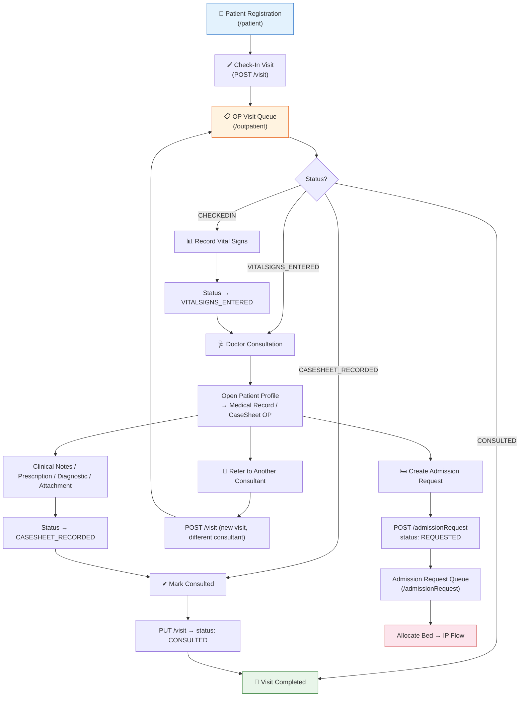

### 1.2 Detailed OP Step-by-Step Logic

#### Step 1 — Patient Registration & Check-In

| Action | Code Reference | API |
|--------|---------------|-----|
| Create new patient | `PatientCtrl.save()` | `POST /patient` |
| Check-in with consultant | `PatientCtrl.checkIn()` | `POST /visit` |
| Duplicate visit check | `patientVisitEntry()` | `GET /visit/patientVisitEntry/{patientId}` |

> [!IMPORTANT]
> During registration, if the "Check-In" checkbox is enabled, a visit is auto-created with the selected consultant and time. Otherwise the patient is only registered.

#### Step 2 — OP Visit Queue (Outpatient Page)

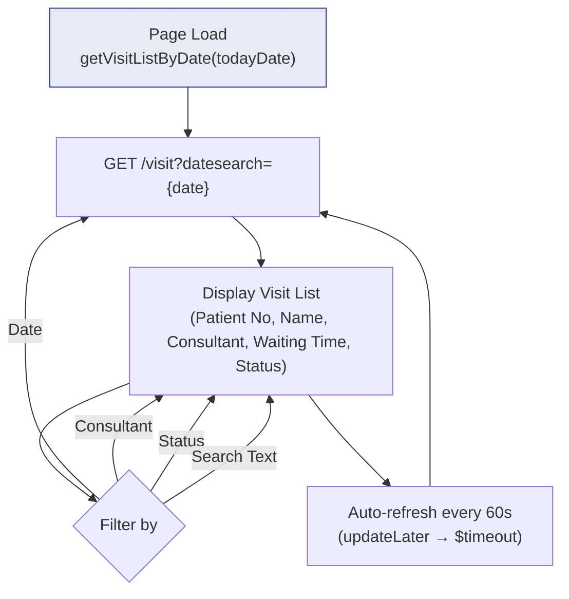

**Visit Status Types** (from `GET /visit/getVisitStatusTypes`):

| Status | Label | Badge Color |
|--------|-------|-------------|
| `CHECKEDIN` | Checked In | 🟡 Warning (yellow) |
| `VITALSIGNS_ENTERED` | Vitals Entered | 🟢 Success (green) |
| `CASESHEET_RECORDED` | Casesheet Recorded | ⚪ Default (grey) |
| `CONSULTED` | Consulted | ⚪ Default (grey) |

**Role-Based Visibility:**
- **ROLE_NURSE** — sees only `CHECKEDIN` visits; can only record Vital Signs
- **Other roles** — see All statuses; can Refer, create Admission Req, record Vitals, open Profile

#### Step 3 — Vital Signs Recording

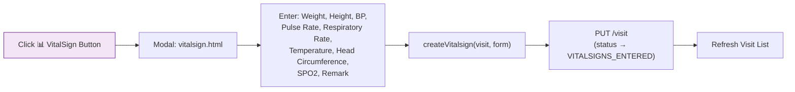

#### Step 4 — Doctor Consultation (Patient Profile)

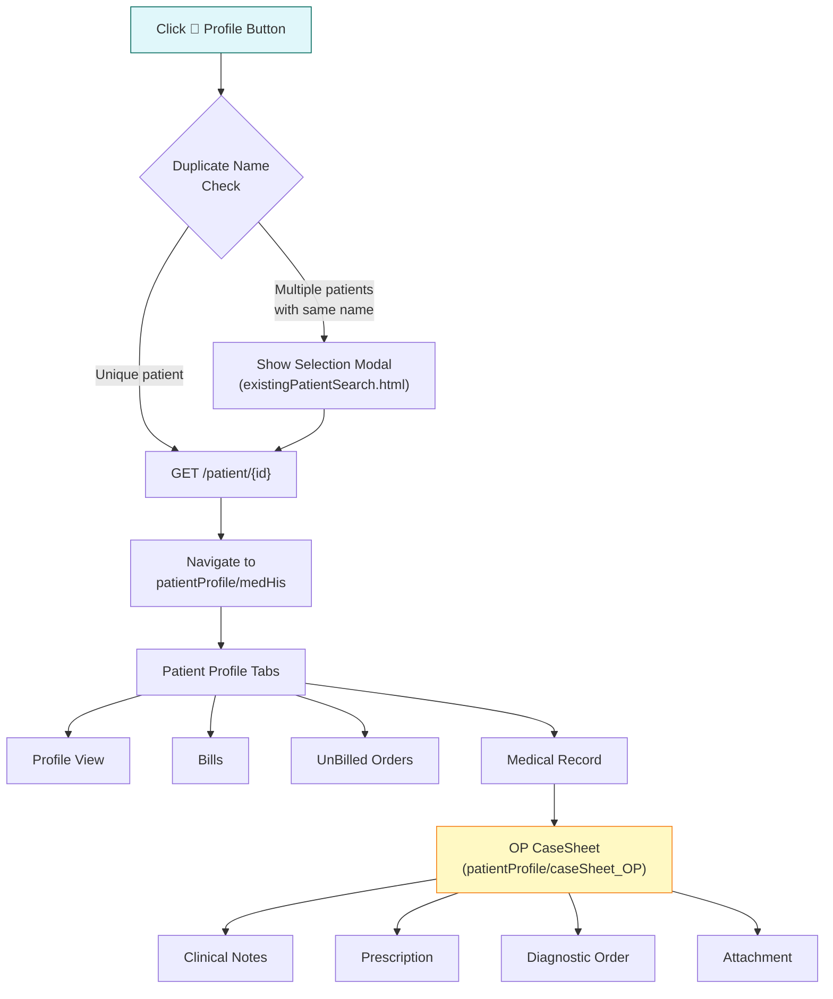

#### Step 5 — Referral (Internal Refer To)

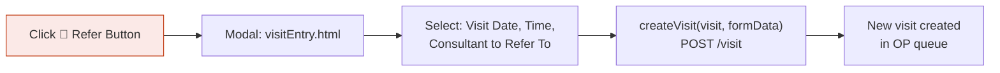

#### Step 6 — Admission Request (OP → IP Bridge)

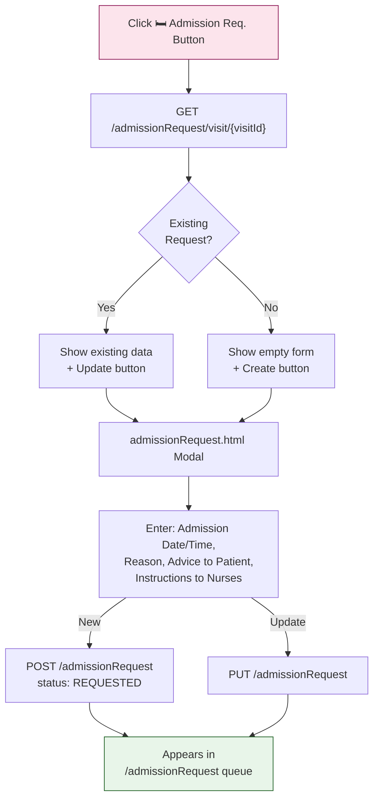

---

## 2. Inpatient (IP) Flow — `/#/inpatient`

**Controller:** `DischargeSummary` → [inpatient.js](file:///home/ssb/Downloads/HIMS/vitalsoft/application/src/main/webapp/app/modules/inpatient/inpatient.js)
**Template:** [index.html](file:///home/ssb/Downloads/HIMS/vitalsoft/application/src/main/webapp/app/modules/inpatient/index.html)

### 2.1 High-Level IP Journey

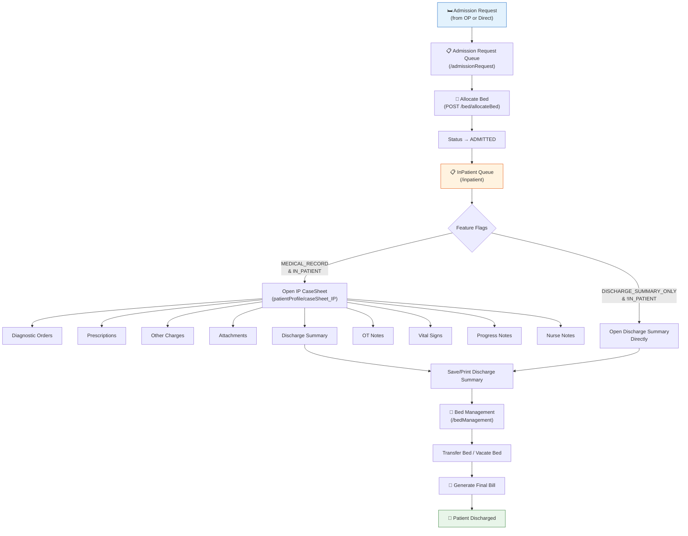

### 2.2 Detailed IP Step-by-Step Logic

#### Step 1 — Admission Request Processing

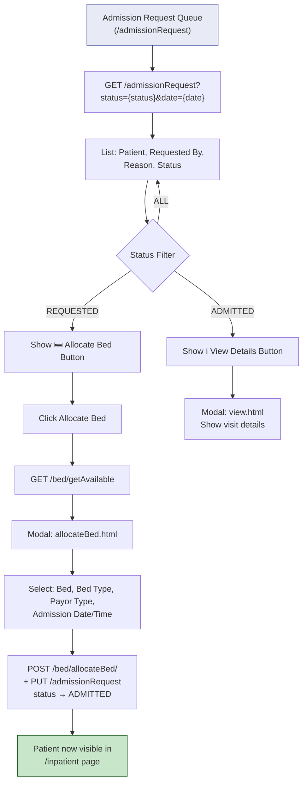

> [!IMPORTANT]
> The Allocate Bed action performs TWO operations: (1) creates a bed allocation record via `POST /bed/allocateBed/`, and (2) updates the admission request status to `ADMITTED` via `PUT /admissionRequest`.

#### Step 2 — InPatient List Page

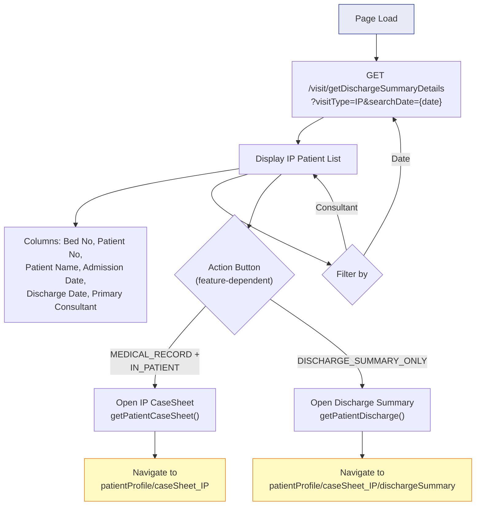

#### Step 3 — IP CaseSheet (Full Medical Record)

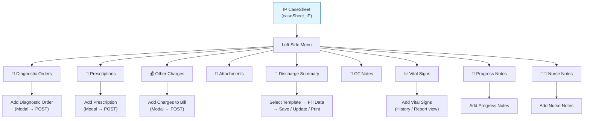

#### Step 4 — Discharge Summary

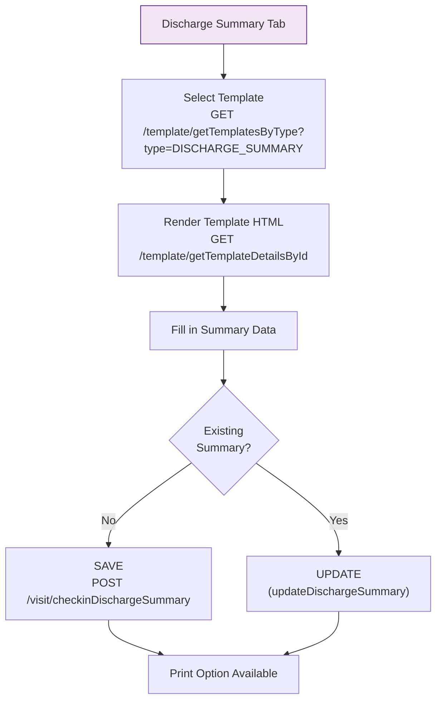

#### Step 5 — Add Discharge Summary (Search Existing Visit)

> [!NOTE]
> This button is only visible when `features.DISCHARGE_SUMMARY_ONLY && !features.IN_PATIENT`. It allows adding discharge summaries for patients found via search.

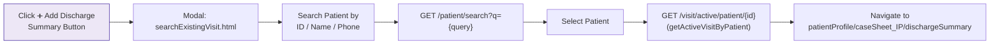

#### Step 6 — Bed Management

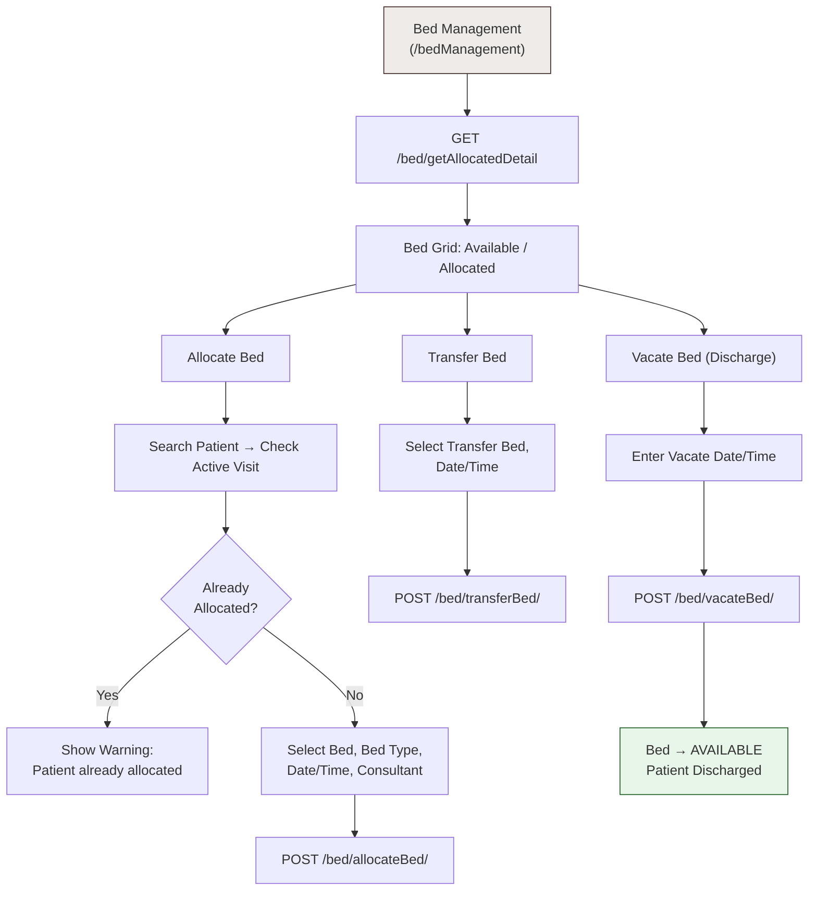

---

## 3. Complete End-to-End Flow (OP → IP → Discharge)

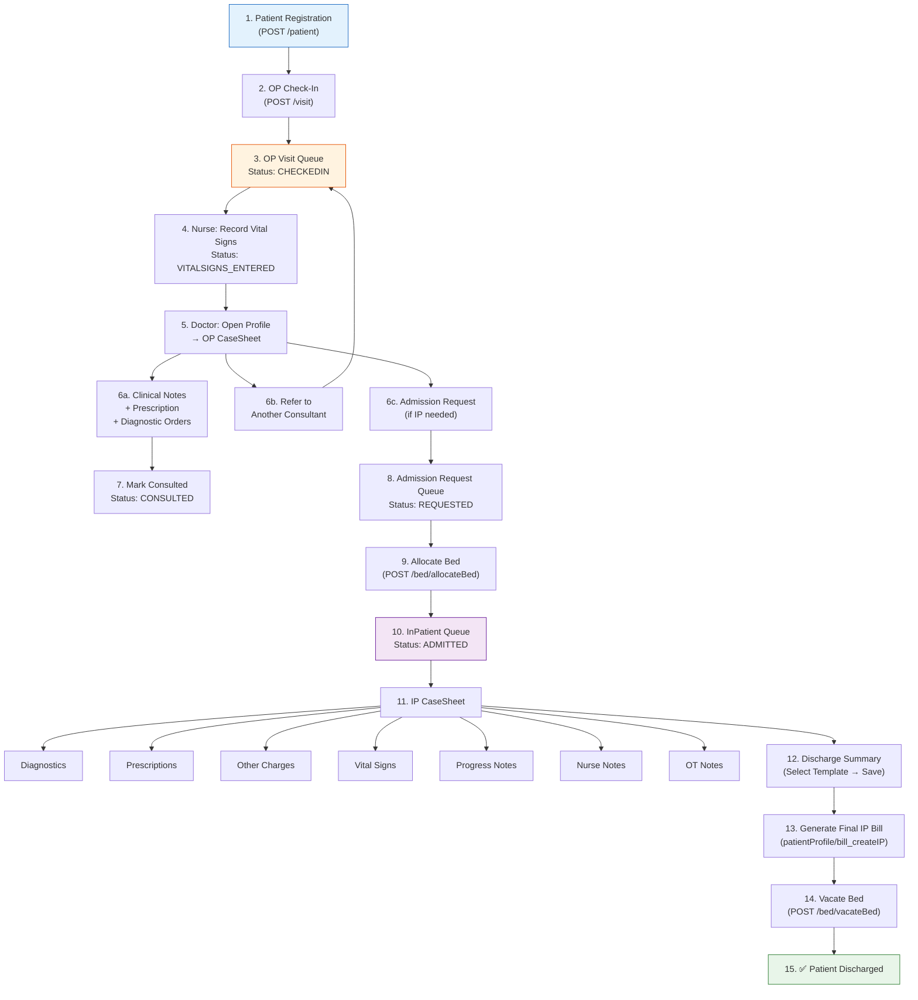

---

## 4. Key API Endpoints Summary

### Outpatient APIs
| API | Method | Purpose |
|-----|--------|---------|
| `/visit?datesearch={date}` | GET | Fetch OP visit list by date |
| `/visit` | POST | Create new visit (check-in / referral) |
| `/visit` | PUT | Update visit (vital signs / mark consulted) |
| `/visit/getVisitStatusTypes` | GET | Get status type labels |
| `/visit/patientVisitEntry/{patientId}` | GET | Check duplicate visit entry |
| `/admissionRequest` | POST | Create admission request |
| `/admissionRequest` | PUT | Update admission request |
| `/admissionRequest/visit/{visitId}` | GET | Get admission by visit |
| `/referConsultant` | POST | Refer patient to consultant |

### Inpatient APIs
| API | Method | Purpose |
|-----|--------|---------|
| `/visit/getDischargeSummaryDetails` | GET | Fetch IP patient list |
| `/visit/checkinDischargeSummary` | POST | Save discharge summary |
| `/visit/active/patient/{id}` | GET | Get active visit for patient |
| `/admissionRequest?status=&date=` | GET | List admission requests |
| `/admissionRequest/getAdmission?date=` | GET | Get status counts |
| `/bed/getAvailable` | GET | List available beds |
| `/bed/allocateBed/` | POST | Allocate bed to patient |
| `/bed/transferBed/` | POST | Transfer patient between beds |
| `/bed/vacateBed/` | POST | Discharge patient (vacate bed) |
| `/bed/getAllocatedDetail` | GET | Get all bed allocations |
| `/template/getTemplatesByType` | GET | Get discharge summary templates |
| `/caseSheet/visit/{visitId}` | GET | Get casesheet for a visit |

---

## 5. Role & Feature-Based Access

| Feature Flag | Controls |
|-------------|----------|
| `PATIENT_PROFILE` | Profile tab visibility |
| `PATIENT_BILLS` | Bills tab visibility |
| `UNBILLED_DIAGNOSTIC_ORDERS` | UnBilled Orders tab |
| `MEDICAL_RECORD` | Medical Record tab + IP CaseSheet button |
| `IN_PATIENT` | Full IP CaseSheet access |
| `DISCHARGE_SUMMARY_ONLY` | Discharge summary–only mode (no full IP) |

| Role | Default Landing | OP Queue Behavior |
|------|----------------|-------------------|
| `ROLE_SUPER_ADMIN` | `/reports` | Full access to all actions |
| `ROLE_DOCTOR` | `/outpatient` | Full access, auto-set as consultant |
| `ROLE_NURSE` | — | Sees only `CHECKEDIN`; can only record Vital Signs |
| `ROLE_RECEPTION` | `/patient` | Patient registration |
| `ROLE_BILLING` | `/search` | Bill creation |
| `ROLE_ADMIN` | `/module` or `/reports` | Admin dashboard |
