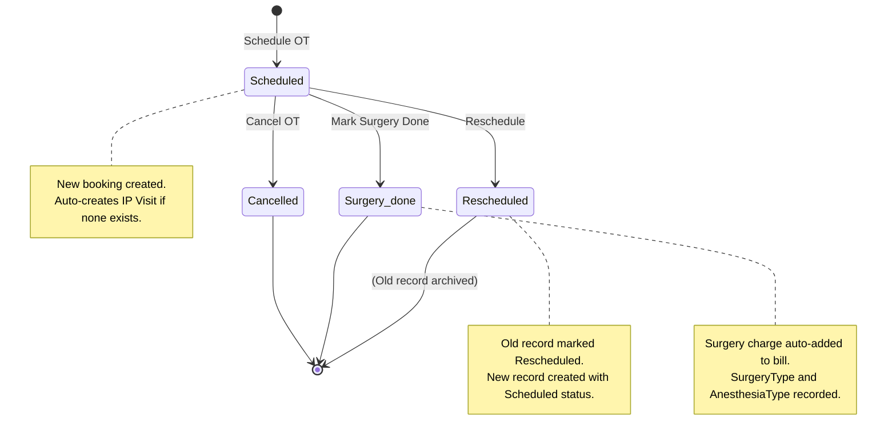
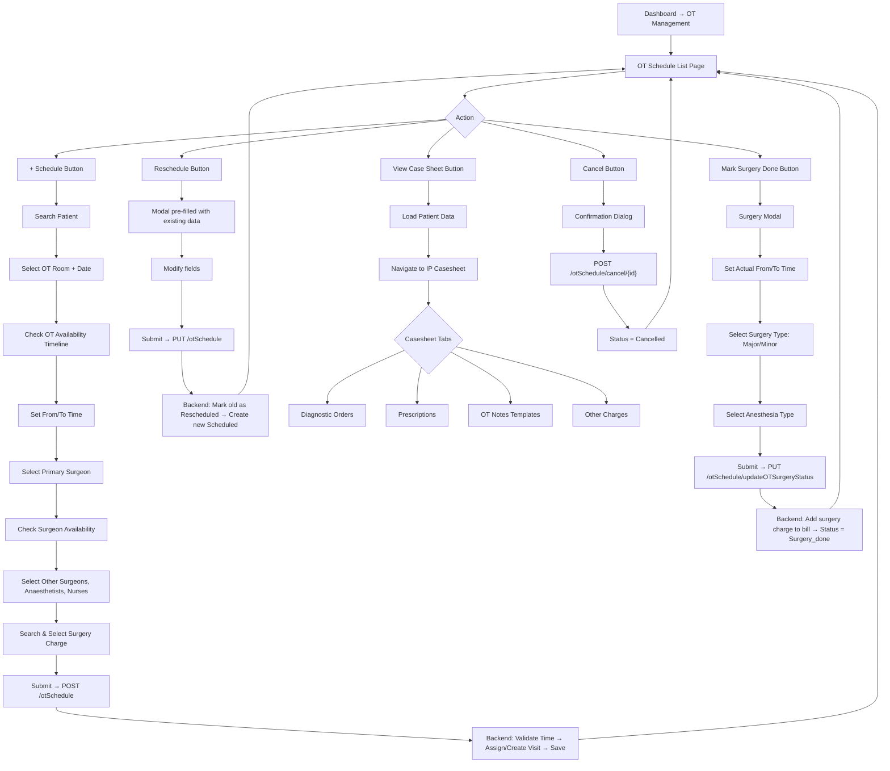

# OT (Operation Theatre) Management Module — HIMS Workflow Document

> [!NOTE]
> This document describes the complete workflow, architecture, data flow, and known bugs of the OT Management module as implemented in the existing SCMC/VitalSoft HIMS application. It is intended to serve as the specification for adding this module into the new HIMS.

---

## 1. Module Overview

The **OT Management** module handles the end-to-end lifecycle of surgical operations within the hospital. It covers:

1. **Master Setup** — Creating and managing Operation Theatre rooms
2. **OT Schedule / Booking** — Scheduling surgeries for patients with all team assignments
3. **Surgery Completion** — Marking surgery as done with surgery type, anesthesia type, and actual timings
4. **Rescheduling & Cancellation** — Modifying or cancelling scheduled operations
5. **OT Case Sheet (Clinical)** — Diagnostic Orders, Prescriptions, OT Notes (templates), Other Charges, and Discharge Summary accessed from the OT schedule
6. **Billing Integration** — Auto-adding the surgery charge to the patient's bill upon surgery completion
7. **Reports** — 8 Jasper reports grouped by Booking and Surgery details

---

## 2. Database Schema

### 2.1 Core Tables

| Table | Purpose |
|---|---|
| `operation_theater` | Master table for OT rooms |
| `ot_scheduler` | Main schedule/booking records |
| `otschedule_surgeon` | Junction table — OT schedule ↔ Other Surgeons (M:M) |
| `otschedule_anaesthetist` | Junction table — OT schedule ↔ Anaesthetists (M:M) |
| `otschedule_staff` | Junction table — OT schedule ↔ Nurses/Staff (M:M) |

### 2.2 `operation_theater` Table

| Column | Type | Description |
|---|---|---|
| `id` | UUID (PK) | Auto-generated primary key (from `BaseModel`) |
| `name` | VARCHAR | Name of the OT room (e.g., "Theater 1", "Theater 2") |
| `status` | INT (Enum) | `0` = Active, `1` = Inactive (`OTStatus` enum) |
| `created_by` | UUID | Audit field (from `BaseModel`) |
| `created_date` | DATETIME | Record creation timestamp (from `BaseModel`) |
| `modified_by` | UUID | Audit field |
| `modified_date` | DATETIME | Last modification timestamp |

### 2.3 `ot_scheduler` Table

| Column | Type | Description |
|---|---|---|
| `id` | UUID (PK) | Auto-generated primary key |
| `patient` | UUID (FK → `patients`) | The patient being operated on. **Non-updatable** after creation |
| `primary_consultant` | UUID (FK → `consultants`) | Primary surgeon |
| `date` | DATE | Scheduled date of the operation |
| `from_time` | TIME | Start time (e.g., `09:00:00`) |
| `to_time` | TIME | End time (e.g., `11:00:00`) |
| `operation_theater` | UUID (FK → `operation_theater`) | Which OT room |
| `surgery` | UUID (FK → `charges`) | The surgery charge item. **Non-updatable** |
| `status` | INT (Enum) | `0`=Scheduled, `1`=Rescheduled, `2`=Cancelled, `3`=Surgery_done |
| `visit` | UUID (FK → `visits`) | Linked IP visit. **Non-updatable** |
| `surgery_type` | INT (Enum) | `0`=Major, `1`=Minor |
| `Anesthesia_type` | INT (Enum) | `0`=General, `1`=Regional, `2`=Local |
| `created_by` | UUID | Audit (from `BaseModel`) — this is the **booking date/user** |
| `created_date` | DATETIME | **Booking creation timestamp** (important for bug reference) |
| `modified_by` | UUID | Audit |
| `modified_date` | DATETIME | Last modification timestamp |

### 2.4 Junction Tables

**`otschedule_surgeon`** (Other Surgeons)

| Column | Type |
|---|---|
| `otScheduler` | UUID (FK → `ot_scheduler`) |
| `otherConsultants` | UUID (FK → `consultants`) |

**`otschedule_anaesthetist`**

| Column | Type |
|---|---|
| `otScheduler` | UUID (FK → `ot_scheduler`) |
| `anaesthetist` | UUID (FK → `consultants`) |

**`otschedule_staff`** (Nurses)

| Column | Type |
|---|---|
| `otScheduler` | UUID (FK → `ot_scheduler`) |
| `staff` | UUID (FK → `staff`) |

### 2.5 Enums

```java
// Status.java
public enum OTSchedulerStatus { Scheduled, Rescheduled, Cancelled, Surgery_done }
public enum OTStatus { Active, Inactive }

// Types.java
public enum SurgeryType { Major, Minor }
public enum AnesthesiaType { General, Regional, Local }
public enum ConsultantType { SURGEON, ANAESTHETIST, DENTIST }
public enum StaffType { NURSING, DRIVER }
public enum ChargeCategoryType { DIAGNOSTICS, CONSULTATION, ROOM_CHARGE, OTHERS, PACKAGES, SURGERY }
```

---

## 3. Master Setup — Operation Theatre Management

### 3.1 Description
Before scheduling any surgery, OT rooms must be created as master data. Each OT room has a name and an Active/Inactive status.

### 3.2 API Endpoints

| Method | URL | Description |
|---|---|---|
| `GET` | `/ot` | List all Operation Theatres |
| `POST` | `/ot` | Create a new OT room |
| `PUT` | `/ot` | Update an existing OT room |
| `GET` | `/ot/{id}` | Get a specific OT by ID |

### 3.3 Backend Flow
- **Controller**: [OTController.java](file:///home/ssb/Sujith/scmc-source-main/application/src/main/java/com/ssb/vitalsoft/controller/OTController.java)
- **Service**: [OTServiceImpl.java](file:///home/ssb/Sujith/scmc-source-main/application/src/main/java/com/ssb/vitalsoft/service/impl/OTServiceImpl.java)
- **DAO**: [OTDaoImpl.java](file:///home/ssb/Sujith/scmc-source-main/application/src/main/java/com/ssb/vitalsoft/dao/impl/OTDaoImpl.java)
- **Entity**: [OperationTheater.java](file:///home/ssb/Sujith/scmc-source-main/application/src/main/java/com/ssb/vitalsoft/model/OperationTheater.java) — Fields: `name`, `status`

### 3.4 Data Required
- OT Name (String)
- Status (Active / Inactive)

---

## 3A. Prerequisite Master Data — How Consultants, Surgery Items, and Nurses Are Categorized

> [!IMPORTANT]
> This section is critical for implementation. It explains the **data model and filtering logic** that determines which records appear in the Primary Surgeon, Other Surgeon, Anaesthetist, Surgery, and Nurses dropdowns on the OT Schedule form.

### 3A.1 Consultants — Surgeon vs Anaesthetist vs Dentist

#### Data Model

The `consultants` table stores **all** doctors/consultants in a single table. They are differentiated by a **`type` column**.

**`consultants` Table:**

| Column | Type | Description |
|---|---|---|
| `id` | UUID (PK) | Unique identifier |
| `salutation` | VARCHAR | e.g., "Dr" |
| `name` | VARCHAR | Doctor's name |
| `qualification` | VARCHAR (NOT NULL) | e.g., "MBBS", "MS Ortho" |
| `type` | ENUM (ConsultantType) | **This is the key field** — determines the role |
| `address` | VARCHAR | Address |
| `contact_no` | VARCHAR (NOT NULL) | Phone number |
| `department` | UUID (FK → `department`) | The department the consultant belongs to |
| `status` | ENUM (DataStatus) | Active/Deleted (from `BaseDataStatusModel`) |
| `fullName` | Computed (Formula) | Auto-computed as `CONCAT(salutation, ' ', name, ' ', qualification)` |

#### The `ConsultantType` Enum

```java
public enum ConsultantType {
    SURGEON,        // ordinal = 0 — stored as 0 in DB
    ANAESTHETIST,   // ordinal = 1 — stored as 1 in DB
    DENTIST         // ordinal = 2 — stored as 2 in DB
}
```

> [!NOTE]
> The `type` column is stored as an **integer ordinal** in the database (0, 1, 2), not as a string.

#### How Categorization Works

When a consultant is **created in the Settings/Master module**, the admin selects the consultant's type:
- If `type = SURGEON` (0) → the consultant appears in **Primary Surgeon** and **Other Surgeon** dropdowns
- If `type = ANAESTHETIST` (1) → the consultant appears in **Anaesthetist** dropdown
- If `type = DENTIST` (2) → the consultant does NOT appear in any OT dropdown

#### How the OT Form Loads Consultants

1. **On page load**, the OT Schedule controller fetches **ALL** consultants (all types):
   ```javascript
   // otSchedule.js - Line 15
   $scope.mScope.consultants = RestService.consultant.query();
   // This calls: GET /consultant  (no type filter — returns all consultants)
   ```

2. **Filtering happens on the frontend** using AngularJS `filter`:

   | Dropdown | AngularJS Filter Expression | Effect |
   |---|---|---|
   | **Primary Surgeon** | `ng-options="... for primaryConsultant in mScope.consultants \| filter : {type : 'SURGEON'}"` | Shows only consultants where `type == 'SURGEON'` |
   | **Other Surgeon** | `ng-options="... for otherConsultant in mScope.consultants \| filter : {type : 'SURGEON'} \| filter : '!'+mScope.mForm.primaryConsultant.id"` | Shows SURGEON type, **excluding** the already-selected Primary Surgeon |
   | **Anaesthetist** | `ng-options="... for otherConsultant in mScope.consultants \| filter : {type : 'ANAESTHETIST'}"` | Shows only consultants where `type == 'ANAESTHETIST'` |

3. **Backend API used**: `GET /consultant` → returns all consultants ordered by `fullName`
   - The controller at `/consultant` calls `consultantService.getConsultants(status)`
   - Returns: `id`, `fullName`, `salutation`, `name`, `qualification`, `type`, `status`, `department.id`, `department.name`
   - The `type` field is included in the response, which the frontend uses for filtering

4. **For Report filter dropdowns**, a separate API is used:
   - `GET /consultant/getConsultantByType?type=SURGEON` → returns only surgeons
   - `GET /consultant/getConsultantByType?type=ANAESTHETIST` → returns only anaesthetists
   - This queries with `WHERE type = :consultantType`

#### Summary Diagram

```
┌──────────────────────────────────────────────┐
│           consultants table                   │
│                                               │
│  Dr. Ravi MS (type=0 SURGEON)       ──────► Primary Surgeon / Other Surgeon dropdown
│  Dr. Priya MD (type=0 SURGEON)      ──────► Primary Surgeon / Other Surgeon dropdown
│  Dr. Sapna MBBS (type=1 ANAESTHETIST) ───► Anaesthetist dropdown
│  Dr. Soumya MBBS (type=1 ANAESTHETIST) ──► Anaesthetist dropdown
│  Dr. Kumar BDS (type=2 DENTIST)     ──────► NOT shown in OT form
│                                               │
└──────────────────────────────────────────────┘
```

---

### 3A.2 Surgery Items — How the Surgery Dropdown Gets Populated

#### Data Model

The **Surgery** dropdown is NOT a separate "surgery master" table. Instead, it pulls from the **`charges`** table, filtered by the charge's **category type**.

**Key Tables:**

```
charges (id, name, category, tariff[], ...)
   └── category (FK → category table)
          └── charge_category_type = 'SURGERY' (enum ordinal = 5)
```

**`charges` Table (relevant fields):**

| Column | Type | Description |
|---|---|---|
| `id` | UUID (PK) | Unique identifier |
| `name` | VARCHAR | Name of the charge (e.g., "Appendectomy", "Caesarean Section") |
| `category` | UUID (FK → `category`) | Links to the category |
| `quantitative` | BOOLEAN | Whether this charge supports quantity |
| `charge_type` | ENUM (ChargeType) | Type of charge |
| `start_date` | DATE | Validity start |
| `end_date` | DATE | Validity end |

**`category` Table (relevant fields):**

| Column | Type | Description |
|---|---|---|
| `id` | UUID (PK) | Unique identifier |
| `name` | VARCHAR | Category name (e.g., "General Surgery", "Ortho Surgery") |
| `type` | ENUM (CategoryType) | Category type |
| `charge_category_type` | INT (Enum) | **The key field**: `ChargeCategoryType` enum |

**`ChargeCategoryType` Enum:**

```java
public enum ChargeCategoryType {
    DIAGNOSTICS,     // ordinal = 0
    CONSULTATION,    // ordinal = 1
    ROOM_CHARGE,     // ordinal = 2
    OTHERS,          // ordinal = 3
    PACKAGES,        // ordinal = 4
    SURGERY          // ordinal = 5  ← THIS is what makes a charge a "surgery item"
}
```

#### How Surgery Items Are Filtered

1. **On the OT Schedule form**, the Surgery field is an **auto-complete** (type-ahead) input:
   ```html
   <auto-complete
       remote-url="charge/getSurgeryChargeByName?name="
       title-field="name" ...>
   ```

2. **When the user types** a surgery name (minimum 1 character, with 300ms debounce), the frontend calls:
   ```
   GET /charge/getSurgeryChargeByName?name={userInput}
   ```

3. **Backend query** (in `ChargeDaoImpl.getSurgeryChargeByName()`):
   ```sql
   SELECT charge.id, charge.name, category.charge_category_type, charge.quantitative
   FROM charges charge
   INNER JOIN category ON charge.category = category.id
   WHERE charge.name LIKE '{userInput}%'          -- starts with the typed text
     AND category.charge_category_type = 5         -- 5 = SURGERY enum ordinal
   GROUP BY charge.id
   ```

4. **The result** is a list of charges whose name starts with the typed text AND whose category has `chargeCategoryType = SURGERY`.

#### How Surgery Pricing Works for Billing

Each charge has a **Set<Tariff>** (one-to-many). When surgery is marked as done:
```java
// OTScheduleServiceImpl.java - getPatientBill()
billDetail.setRate(otScheduler.getSurgery().getTariff().iterator().next().getAmount());
```
- It takes the **first tariff's amount** as the surgery rate
- The `tariff` table has: `charge` (FK), `amount` (int), `payor` (FK), `type` (BillType), `start_date`, `end_date`

#### Summary: How to Make a Charge Appear as a Surgery Item

1. Create a **Category** with `charge_category_type = SURGERY` (e.g., "General Surgery", "Neuro Surgery")
2. Create a **Charge** under that category (e.g., "Appendectomy", "Bypass Surgery")
3. Create a **Tariff** for that charge with the amount
4. Now when a user types "Appen..." in the OT form, "Appendectomy" will appear in the auto-complete

---

### 3A.3 Nurses — How the Nurses Dropdown Gets Populated

#### Data Model

Nurses are stored in the **`staff`** table, which is a shared table for all types of staff.

**`staff` Table:**

| Column | Type | Description |
|---|---|---|
| `id` | UUID (PK) | Unique identifier |
| `name` | VARCHAR (NOT NULL) | Staff name |
| `type` | INT (Enum, NOT NULL) | **The key field**: `StaffType` enum. Non-updatable after creation |
| `status` | ENUM (DataStatus) | Active/Deleted (from `BaseDataStatusModel`) |

**`StaffType` Enum:**

```java
public enum StaffType {
    NURSING,   // ordinal = 0 — stored as 0 in DB
    DRIVER     // ordinal = 1 — stored as 1 in DB
}
```

#### How Nurses Are Loaded

1. **On OT Schedule page load**, the controller fetches staff of type NURSING:
   ```javascript
   // otSchedule.js - Line 11-13
   $http.get('/staff?type=NURSING').success(function(data) {
       $scope.mScope.staffs = data;
   });
   ```

2. **Backend API**: `GET /staff?type=NURSING`
   - Controller: `StaffController.getStaffs(StaffType type)`
   - DAO query:
     ```sql
     SELECT * FROM staff
     WHERE type = 0    -- 0 = NURSING enum ordinal
     ORDER BY type ASC
     ```

3. **On the form**, the Nurses dropdown shows all results:
   ```html
   <select multiple="multiple" ng-model="mScope.mForm.staffs"
           ng-options="staff.name for staff in mScope.staffs">
   ```

4. **Multi-select**: Users can select **multiple** nurses (unlike Primary Surgeon which is single-select)

#### Summary: How to Make a Staff Member Appear as a Nurse

1. Create a **Staff** record with `type = NURSING` (e.g., "Saranya", "Rithika", "Kavitha")
2. That's it — they will appear in the Nurses multi-select on the OT Schedule form
3. Staff with `type = DRIVER` will NOT appear (they are used in the Ambulance module)

---

### 3A.4 Complete Data Flow Summary for OT Schedule Form

```
┌──────────────────────────────────────────────────────────────────┐
│                    OT Schedule Create Form                        │
│                                                                    │
│  ┌─────────────────┐    API: GET /ot                              │
│  │  OT Dropdown     │◄── operation_theater table (all active)     │
│  └─────────────────┘                                              │
│                                                                    │
│  ┌─────────────────┐    API: GET /consultant                      │
│  │ Primary Surgeon  │◄── consultants table WHERE type=SURGEON     │
│  └─────────────────┘    (frontend filter on 'type' field)         │
│                                                                    │
│  ┌─────────────────┐    API: GET /consultant (same response)      │
│  │ Other Surgeon    │◄── consultants WHERE type=SURGEON           │
│  │ (multi-select)   │    MINUS selected Primary Surgeon           │
│  └─────────────────┘    (frontend filter + exclusion)             │
│                                                                    │
│  ┌─────────────────┐    API: GET /consultant (same response)      │
│  │ Anaesthetist     │◄── consultants WHERE type=ANAESTHETIST      │
│  │ (multi-select)   │    (frontend filter on 'type' field)        │
│  └─────────────────┘                                              │
│                                                                    │
│  ┌─────────────────┐    API: GET /charge/getSurgeryChargeByName   │
│  │ Surgery          │◄── charges table                            │
│  │ (auto-complete)  │    JOIN category                            │
│  └─────────────────┘    WHERE category.charge_category_type=SURGERY│
│                         AND charge.name LIKE '{input}%'            │
│                                                                    │
│  ┌─────────────────┐    API: GET /staff?type=NURSING              │
│  │ Nurses           │◄── staff table WHERE type=NURSING           │
│  │ (multi-select)   │    (backend filter)                         │
│  └─────────────────┘                                              │
│                                                                    │
└──────────────────────────────────────────────────────────────────┘
```

### 3A.5 Key Implementation Notes for New HIMS

> [!IMPORTANT]
> **For the AI/developer implementing this in the new HIMS:**

1. **Consultant categorization** is done at **consultant creation time**, not at OT scheduling time. The admin assigns a type (SURGEON / ANAESTHETIST / DENTIST) when creating a consultant in the Settings module. The OT module simply reads this type.

2. **Surgery items are regular charge/billing items** — they are NOT a separate entity. The differentiation is that they belong to a category whose `chargeCategoryType = SURGERY`. So the Charges/Billing master must support this category type before OT scheduling can work.

3. **The frontend fetches ALL consultants in one API call** and filters by type client-side. This is a design choice — the alternative would be separate API calls for surgeons and anaesthetists. If your HIMS has many consultants, consider backend filtering instead.

4. **Nurses come from the Staff master**, not from the Consultant master. Staff and Consultants are completely separate entities. Staff uses `StaffType` (NURSING, DRIVER), while Consultants use `ConsultantType` (SURGEON, ANAESTHETIST, DENTIST).

5. **Other Surgeon excludes the Primary Surgeon**: Once a Primary Surgeon is selected, that same person is filtered out from the Other Surgeon multi-select to prevent duplication.

6. **Surgery auto-complete uses starts-with matching** (`LIKE 'input%'`), not contains matching. So typing "App" will find "Appendectomy" but typing "ectomy" will NOT.

---

## 4. OT Schedule / Booking — Main Workflow

### 4.1 UI Entry Points

1. **Dashboard** → "OT Management" tile → navigates to `/otSchedule`
2. The [dashboard module.html](file:///home/ssb/Sujith/scmc-source-main/application/src/main/webapp/app/modules/dashboard/module.html#L99-L108) card triggers feature `OTSCHEDULE`
3. [main.js](file:///home/ssb/Sujith/scmc-source-main/application/src/main/webapp/app/modules/main.js#L298-L299) routes to `$location.path('/otSchedule')`

### 4.2 OT Schedule List Page

**File**: [otSchedule/index.html](file:///home/ssb/Sujith/scmc-source-main/application/src/main/webapp/app/modules/otSchedule/index.html)

The main list page shows all OT schedules for a selected date and provides:

#### 4.2.1 Filter Controls
| Filter | Type | Behavior |
|---|---|---|
| **Date** | Date picker | Filters schedules by the selected OT scheduled date. Default = today. On change calls `getOTScheduleByDate(searchDate)` |
| **Consultant** | Dropdown (Select Consultant) | Client-side filter by primary consultant's `fullName`. Fetches list from `/consultant?status=notDeleted` |
| **Status** | Dropdown | Client-side filter. Options: **All**, **Scheduled** (default), **Rescheduled**, **Surgery done**, **Cancelled** |

#### 4.2.2 Grid Columns
| # | Column | Binding |
|---|---|---|
| 1 | S.NO | `$index + 1` |
| 2 | PATIENT | `data.patient.patientNo.value` + `data.patient.fullName` |
| 3 | CONSULTANT | `data.primaryConsultant.fullName` |
| 4 | SURGERY | `data.surgery.name` |
| 5 | DATE | `data.date` (formatted `yyyy-MM-dd`) |
| 6 | TIME | `data.fromTime` – `data.toTime` (with `:00` stripped) |
| 7 | STATUS | `data.status` |
| 8 | ACTION | Action buttons (conditional on status) |

#### 4.2.3 Action Buttons (per row)

| Button | Icon | Visible When | Action |
|---|---|---|---|
| **Reschedule** | `fa-reply-all` | `status == 'Scheduled'` | Opens the create modal pre-populated, submits via `rescheduleOT(mForm)` |
| **View Case Sheet** | `fa-user` | `status == 'Scheduled'` OR `'Surgery_done'` | Calls `viewCaseSheet(data)` → navigates to OT casesheet |
| **Mark Surgery Done** | `fa-check` | `status == 'Scheduled'` (and NOT `Surgery_done`) | Opens the Surgery modal to update status |
| **Cancel OT** | `fa-times` | `status == 'Scheduled'` | Confirmation dialog → calls `cancelOT(data)` |

### 4.3 Schedule an Operation — Create Modal

**File**: [otSchedule/create.html](file:///home/ssb/Sujith/scmc-source-main/application/src/main/webapp/app/modules/otSchedule/create.html)

This is a **modal dialog** titled "Schedule an Operation" with the following form:

#### 4.3.1 Patient Search (New Booking Only)
- Shown only when `!mScope.mForm.id` (i.e., new booking, not reschedule)
- Input: Text field accepting **Patient ID / Name / Phone Number**
- On search click → calls `GET /patient/search?q={searchData}`
- If **exactly 1 result** → auto-selects the patient
- If **multiple results** → opens a patient search popup modal for selection
- Once selected, shows patient info: `PatientNo | FullName (Gender / Age)` with a ✖ to reset

#### 4.3.2 Reschedule Mode
- When `mScope.mForm.id` exists (editing), shows read-only info:
  - Patient Name, Schedule Date, Time, Consultant, Surgery, OT Room
  - All fields below are still editable for the reschedule

#### 4.3.3 Form Fields

| Field | Type | Required | Data Source / Behavior |
|---|---|---|---|
| **OT** | Dropdown (Select Theater) | ✅ | Populated from `RestService.operationTheaters.query()` → `GET /ot`. On change → triggers `getOTAvailability(otId, date)` |
| **Date** | Date Picker | ✅ | Default = today. Minimum = today. On change → re-checks consultant availability AND OT availability |
| **From Time** | Time Picker (`hh:mm am`) | ✅ | Uses Bootstrap Timepicker directive (see §4.4) |
| **To Time** | Time Picker (`hh:mm am`) | ✅ | Uses Bootstrap Timepicker directive (see §4.4) |
| **Primary Surgeon** | Dropdown | ✅ | Filtered from `mScope.consultants` where `type == 'SURGEON'`. On change → calls `getConsultantAvailability(id, date)` |
| **Other Surgeon** | Multi-select | ❌ | Filtered from surgeons list, **excluding** the selected Primary Surgeon. On change → calls `getOtherConsultantAvailability(ids, date, 'SURGEON')` |
| **Surgery** | Auto-complete | ✅ | Types charge name → calls `GET /charge/getSurgeryChargeByName?name={input}` (with 300ms debounce, min 1 char). Shows charge name. Selects the `Charge` object |
| **Anaesthetist** | Multi-select | ❌ | Filtered from `mScope.consultants` where `type == 'ANAESTHETIST'`. On change → calls `getOtherConsultantAvailability(ids, date, 'ANAESTHETIST')` |
| **Nurses** | Multi-select | ❌ | Populated from `GET /staff?type=NURSING`. On change → calls `getStaffAvailability(staffIds, date)` |

#### 4.3.4 Availability Display

When OT, consultant, or staff availability is checked, the UI shows inline alerts:
- **OT Availability**: Shows a timeline for the selected OT room on the selected date
  - 🟢 **Green alert**: `"{timeSlot} is available"` — the slot is free
  - 🔵 **Blue/Info alert**: `"{timeSlot} is allotted for Patient {name}"` — already booked
- **Primary Surgeon**: Red warning text if the surgeon has another surgery on that date, showing patient name and time
- **Other Surgeons / Anaesthetists**: Yellow warning alert with same info
- **Nurses/Staff**: Yellow warning alert if staff is already assigned to another OT that day

#### 4.3.5 Submit Button
- Text: **"Schedule"** (new) or **"Reschedule"** (edit)
- Only submits if `mScope.consultantAvailability == ''` (no primary surgeon conflict)
- Calls `scheduleOT(mForm)` or `rescheduleOT(mForm)`

### 4.4 Time Picker — How From/To Time Works

**Directive file**: [timeField.js](file:///home/ssb/Sujith/scmc-source-main/application/src/main/webapp/app/common/directive/timeField.js)

The `<time>` custom directive wraps the **Bootstrap Timepicker** jQuery plugin.

#### How it works:
1. Renders an `<input type="text">` with placeholder `hh:mm am`
2. Initializes Bootstrap Timepicker with:
   - `template: false` (inline, no dropdown popup)
   - `showInputs: false`
   - `minuteStep: 5` (increments in 5-minute intervals)
   - `defaultTime: false` (starts empty, not current time)
3. User types or uses arrows to enter time like `9:00 am`
4. On `changeTime.timepicker` event, the `ng-change` fires
5. The **`ng-change` expression** in the HTML transforms the value:
   ```javascript
   // For From Time:
   mScope.mForm.fromTime = fromTime.split(' ')[0] + ':00 ' + fromTime.split(' ')[1]
   // Example: "9:00 am" → "9:00:00 am"
   
   // Then validates:
   mScope.checkOTScheduleTime(mScope.mForm.fromTime, mScope.mForm.toTime)
   ```
6. The `:00` seconds are appended inline to convert `hh:mm am` → `hh:mm:00 am` format for the backend `java.sql.Time`
7. If `fromTime == toTime`, shows a **"Same Time !"** warning
8. On the grid list display, the `:00` seconds are stripped back: `data.fromTime.replace(':00','')`

#### Summary:
| User Enters | Stored Value | Display in Grid |
|---|---|---|
| `9:00 am` | `9:00:00 am` → `java.sql.Time 09:00:00` | `9:00 am` |
| `2:30 pm` | `2:30:00 pm` → `java.sql.Time 14:30:00` | `2:30 pm` |

### 4.5 Backend Flow — Scheduling

**Controller**: [OTScheduleController.java](file:///home/ssb/Sujith/scmc-source-main/application/src/main/java/com/ssb/vitalsoft/controller/OTScheduleController.java)
**Service**: [OTScheduleServiceImpl.java](file:///home/ssb/Sujith/scmc-source-main/application/src/main/java/com/ssb/vitalsoft/service/impl/OTScheduleServiceImpl.java)
**DAO**: [OTScheduleDaoImpl.java](file:///home/ssb/Sujith/scmc-source-main/application/src/main/java/com/ssb/vitalsoft/dao/impl/OTScheduleDaoImpl.java)

#### 4.5.1 Create OT Schedule (`POST /otSchedule`)

```
Frontend → OTSchedulerDto (JSON) → OTScheduleController.createOTScheduler()
→ OTScheduleServiceImpl.createOTScheduler() → saveOT()
```

**`saveOT()` does 3 things:**

1. **Set Status** → `OTSchedulerStatus.Scheduled`
2. **Validate OT Time** → `validateOTTime(otScheduler)`:
   - Fetches all existing scheduled entries for the same OT room + date
   - Checks `fromTime < toTime` (else throws "Please choose valid time")
   - Checks no overlap with existing bookings:
     - If new booking's from/to is entirely within an existing booking → error
     - If new booking's from/to exactly matches an existing booking → error
   - ⚠️ **Note**: The overlap validation is incomplete — it doesn't catch all overlapping scenarios (e.g., partially overlapping or wrapping around existing slots)
3. **Assign Visit** → `assignVisit(otScheduler)`:
   - Looks for an **active IP visit** for the patient: `visitDao.getActiveVisit(patientId)`
   - If **no active visit** → **auto-creates a new IP visit** with:
     - `visitType = IP`
     - `patient` = the patient
     - `consultant` = primary surgeon
     - `date` = OT schedule date
   - Sets the visit on the OT scheduler
4. **Save** → `otScheduleDao.createOTScheduler(otScheduler)` (Hibernate `session.save()`)

#### 4.5.2 Reschedule OT (`PUT /otSchedule`)

```
Frontend → OTSchedulerDto → OTScheduleController.updateOTSchedule()
→ OTScheduleServiceImpl.updateOTScheduler()
```

Process:
1. Fetch the **existing** OT schedule by ID
2. Set the **old** record's status → `Rescheduled`
3. Update old record in DB
4. Call `saveOT()` on the **new** data (effectively creates a brand-new schedule with `Scheduled` status)

> [!IMPORTANT]
> Rescheduling does NOT update in-place. It marks the old one as `Rescheduled` and creates a **new** record with `Scheduled` status. This means each reschedule creates an additional row in the database.

#### 4.5.3 Cancel OT (`POST /otSchedule/cancel/{id}`)

- Fetches the OT schedule by ID
- Sets status → `Cancelled`
- Updates in DB

#### 4.5.4 Get Schedules by Date (`GET /otSchedule?date=yyyy-MM-dd`)

- Calls `otScheduleDao.getOTSchedulers(date)`
- Hibernate Criteria: `WHERE date = :date`
- Returns all statuses (Scheduled, Rescheduled, Cancelled, Surgery_done)

### 4.6 Availability Check APIs

| Endpoint | Method | Parameters | Returns |
|---|---|---|---|
| `/otSchedule/getConsultantAvailability` | GET | `consultantId` (UUID[]), `date`, `consultantType` (optional) | String message if consultant is busy |
| `/otSchedule/getOTAvailability` | GET | `otId`, `date` | `HashMap<Integer, HashMap<String, Object>>` — timeline of slots |
| `/otSchedule/getStaffAvailability` | GET | `staffId` (UUID[]), `date` | String message if staff is busy |
| `/otSchedule/getSurgeryType` | GET | — | `List<DataDto>` — enum values of `SurgeryType` |

#### OT Availability Timeline Logic (`getOTAvailability`)

Given an OT room + date, it builds a **visual timeline**:

1. Fetch all `Scheduled` entries for that OT, ordered by `fromTime ASC`
2. If bookings exist:
   - First slot: `12:00 AM → first booking's fromTime` (available ✅)
   - Each booking: `fromTime → toTime` (occupied, shows patient name)
   - Gaps between bookings: marked as available
   - Last slot: `last booking's toTime → 11:59 PM` (available ✅)
3. If no bookings: `12:00 AM → 11:59 PM` (fully available)

#### Consultant/Staff Availability Logic

- Queries all `Scheduled` OT entries for the given consultant/staff on the given date
- If found, returns a message like: `"Dr. X has another surgery on the same date for the Patient Y (9:00 AM - 11:00 AM)"`
- For **Primary Surgeon**: filters by `primary_consultant`
- For **Other Surgeons**: joins `otschedule_surgeon`, filters by `otherConsultants.id`
- For **Anaesthetist**: joins `otschedule_anaesthetist`, filters by `anaesthetist.id`
- For **Nurses/Staff**: joins `otschedule_staff`, filters by `staffs.id`

---

## 5. Surgery Completion (Mark Surgery Done)

### 5.1 Surgery Modal

**File**: [otSchedule/surgery.html](file:///home/ssb/Sujith/scmc-source-main/application/src/main/webapp/app/modules/otSchedule/surgery.html)

When the user clicks the ✔ (check mark) button on a `Scheduled` row, a modal opens with:

| Field | Type | Options | Required |
|---|---|---|---|
| **Date** | Read-only display | Shows the scheduled date | — |
| **From Time** | Time Picker | Pre-populated with existing from time. Editable for actual surgery time | ✅ |
| **To Time** | Time Picker | Pre-populated with existing to time. Editable for actual surgery time | ✅ |
| **Surgery Type** | Dropdown | **Major** / **Minor** | ✅ |
| **Anesthesia Type** | Dropdown | **General** / **Regional** / **Local** | ✅ |

Submit button: **"Update OT"**

### 5.2 Backend — `PUT /otSchedule/updateOTSurgeryStatus`

```
Frontend → OTSchedulerDto → OTScheduleController.updateOTSurgeryStatus()
→ OTScheduleServiceImpl.updateOTSurgeryStatus()
```

**Process:**
1. Fetch existing OT schedule by ID
2. **Check for active bill**: `getPatientBill(patientId, otScheduler)`
   - Gets the patient's active visit
   - If visit exists **and** has a bill:
     - Creates a `BillDetail` with:
       - `charge` = surgery charge
       - `rate` = surgery charge's first tariff amount
       - `quantity` = 1
       - `amount` = rate
     - Calls `billService.addChargeToBill(billId, billDetails)` to **auto-add the surgery charge to the patient's IP bill**
     - Returns `true`
   - If no visit → returns `false` → throws **"No Active Bill For the Patient"**
3. If billing succeeds:
   - Sets status → `Surgery_done`
   - Updates `fromTime`, `toTime` (actual surgery times)
   - Updates `surgeryType` and `anesthesiaType`
   - Saves to DB

> [!IMPORTANT]
> **Billing Integration**: When surgery is marked done, the surgery charge is automatically added to the patient's IP bill. The rate is taken from the first tariff associated with the surgery charge item. If the patient has no active bill, the operation will fail with an error.

---

## 6. OT Case Sheet (Clinical Views)

### 6.1 How It's Accessed

When the user clicks the 👤 (user icon) button on the OT schedule list, the `viewCaseSheet(ot)` function is called:

```javascript
// otSchedule.js - Line 121-129
$scope.viewCaseSheet = function(ot) {
    let visit = ot.visit;
    visit.ot = { 
        issueType: 'OT',
        views: ['diagnostic', 'prescription', 'otNotes', 'otherCharges']
    };
    $http.get('/patient/' + ot.patient.id).success(function(data) {
        SharedService.setPatientData(data);
        SharedService.setVisitData(visit);
        $location.path("patientProfile/caseSheet_IP/otNotes");
    });
}
```

**What happens:**
1. The visit object is enriched with `ot` context: `{ issueType: 'OT', views: [...] }`
2. The `views` array controls which **sidebar tabs** are visible in the casesheet when accessed from OT
3. Patient and visit data are stored in `SharedService`
4. Navigates to `patientProfile/caseSheet_IP/otNotes` (OT Notes tab opens by default)

### 6.2 Available Tabs in OT Case Sheet

The IP Case Sheet ([index_IP.html](file:///home/ssb/Sujith/scmc-source-main/application/src/main/webapp/app/modules/medical/casesheet/index_IP.html)) has a left sidebar with icon-based navigation. When accessed from OT, these tabs are shown based on the `views` array:

| Tab | Icon | Route | Description |
|---|---|---|---|
| **Diagnostic Orders** | `fa-flask` | `/caseSheet_IP/diag` | Lab/diagnostic test orders for the patient |
| **Prescriptions** | Prescription icon | `/caseSheet_IP/prescrp` | Medication prescriptions |
| **OT Notes** | `fa-file-text-o` | `/caseSheet_IP/otNotes` | Template-based OT surgical notes |
| **Other Charges** | `fa-inr` (₹ symbol) | `/caseSheet_IP/otherChrg` | Additional charges to add to the bill |

Additionally, the full IP casesheet also has these tabs (accessible when navigating from IP module, not restricted by `views`):
- Attachments
- Discharge Summary
- Vital Signs
- Progress Notes
- Nurse Notes

### 6.3 OT Notes — Template System

**File**: [otNotes.html](file:///home/ssb/Sujith/scmc-source-main/application/src/main/webapp/app/modules/medical/casesheet/otNotes.html)

The OT Notes tab provides a **template-based** documentation system for surgical notes:

1. **Template Selection**: A dropdown lists available OT templates (`mScope.otTemplates`)
   - Each template has: `id`, `templateName`
   - Fetched on initialization via `initOTNotes()`
2. **Template Rendering**: Once selected:
   - Shows the template name as a label
   - Renders the template form using a `template-form` directive in **edit mode** (`t-mode="edit"`)
   - The `summaryData` object holds the form data
   - Template ID: `otTemplate.id`, Template name: `otTemplate.templateName`
3. **Purpose**: Allows surgeons to fill in structured surgical notes (pre-operative, intra-operative, post-operative findings, etc.) using pre-defined templates

### 6.4 Diagnostic Orders

- Route: `/caseSheet_IP/diag`
- Shows existing diagnostic orders for the visit
- "**+ ADD DIAGNOSTIC ORDER**" button to create new lab/diagnostic orders
- When no orders exist: shows message "No Diagnostics Order! There is no Diagnostics order for the visit"
- This is the same diagnostic ordering system used across the HIMS, filtered by the current visit

### 6.5 Prescriptions

- Route: `/caseSheet_IP/prescrp`
- Medication prescription management for the patient's visit
- Standard prescription module shared with IP module

### 6.6 Other Charges

- Route: `/caseSheet_IP/otherChrg`
- Allows adding additional billing charges (e.g., OT consumables, implants, etc.)
- These charges are added to the patient's active bill

### 6.7 Discharge Summary

- Route: `/caseSheet_IP/dischargeSummary`
- Available in the full IP casesheet (visible based on feature flags)
- Template-based discharge summary that includes surgical details

---

## 7. Reports

### 7.1 Reports List

All reports are accessible from [report/ot.html](file:///home/ssb/Sujith/scmc-source-main/application/src/main/webapp/app/modules/report/ot.html) and are built using **JasperReports** (JRXML).

Report files located at: [`application/src/main/reports/ot/`](file:///home/ssb/Sujith/scmc-source-main/application/src/main/reports/ot)

#### OT Booking Reports (3)

| # | Report Name | File | Group By |
|---|---|---|---|
| 1 | OT Booking Details Anaesthetist-wise | `OT_Booking_details_AnaesthetistWise.jrxml` | Anaesthetist |
| 2 | OT Booking Details Surgeon-wise | `OT_Booking_details_SurgeonWise.jrxml` | Surgeon |
| 3 | OT Booking Details Theater-wise | `OT_Booking_details_Theater_Wise.jrxml` | OT Room |

#### OT Surgery Reports (5)

| # | Report Name | File | Group By |
|---|---|---|---|
| 4 | OT Surgery Details Anaesthetist-wise | `OT_Surgery_details_AnaesthetistWise.jrxml` | Anaesthetist |
| 5 | OT Surgery Details Surgeon-wise | `OT_Surgery_details_SurgeonWise.jrxml` | Surgeon |
| 6 | OT Surgery Details Theater-wise | `OT_Surgery_details_Theater_Wise.jrxml` | OT Room |
| 7 | OT Surgery Details Department-wise | `OT_Surgery_details_DepartmentWise.jrxml` | Department |
| 8 | OT Surgery Details SurgeryType-wise | `OT_Surgery_details_SurgeryTypeWise.jrxml` | Surgery Type (Major/Minor) |

#### Additional:
| # | Report Name | File | Location |
|---|---|---|---|
| 9 | OT Bill Raised | `OT_Bill_Raised.jrxml` | `reports/sales/` |

### 7.2 Report Parameters

All OT reports accept these common parameters:

| Parameter | Type | Description |
|---|---|---|
| `From_Date` | `java.util.Date` | Start of date range |
| `To_Date` | `java.util.Date` | End of date range |
| `User_Name` | `java.lang.String` | Logged-in user (shown in footer) |
| `Surgeon` / `Anaesthetist` / `Theater` | `java.lang.String` | Filter parameter (varies by report) |

The filter dropdowns are dynamically populated via `datapath` properties:
- Surgeon: `GET /consultant/getConsultantByType?type=SURGEON`
- Anaesthetist: `GET /consultant/getConsultantByType?type=ANAESTHETIST`
- Surgery Type: `GET /otSchedule/getSurgeryType`

### 7.3 Report Columns (Example: Surgery Details Surgeon-wise)

| Column | SQL Source |
|---|---|
| S No | `REPORT_COUNT` |
| OTS No | Placeholder (hardcoded `"-"`) |
| OTS Date & Time | `DATE_FORMAT(ot_sche.date,'%d/%m/%Y')` |
| Patient Id | `patient_number.value` |
| IP No | Placeholder (hardcoded `"-"`) |
| Patient's Name | `CONCAT(salutation, first_name, last_name)` |
| Age | Calculated from `approx_dob` (years/months/days) |
| Gender | `CASE sex WHEN 0 THEN 'Male' WHEN 1 THEN 'Female'` |
| Bed No | Placeholder (hardcoded `"-"`) |
| Ward | Placeholder (hardcoded `"-"`) |
| Surgery Name | `charges.name` |
| Surgery Type | `CASE surgery_type WHEN 0 THEN 'MAJOR' WHEN 1 THEN 'MINOR'` |
| Start Date & Time | `date + from_time` formatted |
| End Date & Time | `date + to_time` formatted |
| Surgery Duration | `TIMESTAMPDIFF(hour/minute, from_time, to_time)` |
| OT No | `operation_theater.name` |
| Anesthetist Name | `consultants (via otschedule_anaesthetist join)` |
| Anesthesia Type | `CASE Anesthesia_type WHEN 0 THEN 'General'...` |
| User Login | `users.first_name + last_name` |

---

## 8. REST API Reference — Complete

| Method | Endpoint | Description | Request Body | Response |
|---|---|---|---|---|
| `GET` | `/ot` | List all OT rooms | — | `List<OperationTheater>` |
| `POST` | `/ot` | Create OT room | `OperationTheaterDto` | Success message + entity |
| `PUT` | `/ot` | Update OT room | `OperationTheaterDto` | Success message + entity |
| `GET` | `/ot/{id}` | Get OT room by ID | — | `OperationTheater` |
| `GET` | `/otSchedule?date=` | List schedules by date | — | `List<OTScheduler>` |
| `POST` | `/otSchedule` | Create new OT booking | `OTSchedulerDto` | Success message + entity |
| `PUT` | `/otSchedule` | Reschedule OT | `OTSchedulerDto` | Success message + entity |
| `PUT` | `/otSchedule/updateOTSurgeryStatus` | Mark surgery done | `OTSchedulerDto` | Success message + entity |
| `GET` | `/otSchedule/{id}` | Get schedule by ID | — | `OTScheduler` |
| `POST` | `/otSchedule/cancel/{id}` | Cancel OT booking | — | Success message |
| `GET` | `/otSchedule/getConsultantAvailability` | Check consultant availability | `consultantId`, `date`, `consultantType` | String message |
| `GET` | `/otSchedule/getOTAvailability` | Check OT room availability | `otId`, `date` | Availability timeline map |
| `GET` | `/otSchedule/getStaffAvailability` | Check staff availability | `staffId[]`, `date` | String message |
| `GET` | `/otSchedule/getSurgeryType` | Get surgery type enum values | — | `List<DataDto>` |

---

## 9. File Location Reference

### Backend (Java)

| Layer | File | Path |
|---|---|---|
| **Controller** | [OTController.java](file:///home/ssb/Sujith/scmc-source-main/application/src/main/java/com/ssb/vitalsoft/controller/OTController.java) | `controller/` |
| **Controller** | [OTScheduleController.java](file:///home/ssb/Sujith/scmc-source-main/application/src/main/java/com/ssb/vitalsoft/controller/OTScheduleController.java) | `controller/` |
| **Service** | [OTService.java](file:///home/ssb/Sujith/scmc-source-main/application/src/main/java/com/ssb/vitalsoft/service/OTService.java) | `service/` |
| **Service** | [OTScheduleService.java](file:///home/ssb/Sujith/scmc-source-main/application/src/main/java/com/ssb/vitalsoft/service/OTScheduleService.java) | `service/` |
| **Service Impl** | [OTServiceImpl.java](file:///home/ssb/Sujith/scmc-source-main/application/src/main/java/com/ssb/vitalsoft/service/impl/OTServiceImpl.java) | `service/impl/` |
| **Service Impl** | [OTScheduleServiceImpl.java](file:///home/ssb/Sujith/scmc-source-main/application/src/main/java/com/ssb/vitalsoft/service/impl/OTScheduleServiceImpl.java) | `service/impl/` |
| **DAO** | [OTDao.java](file:///home/ssb/Sujith/scmc-source-main/application/src/main/java/com/ssb/vitalsoft/dao/OTDao.java) | `dao/` |
| **DAO** | [OTScheduleDao.java](file:///home/ssb/Sujith/scmc-source-main/application/src/main/java/com/ssb/vitalsoft/dao/OTScheduleDao.java) | `dao/` |
| **DAO Impl** | [OTDaoImpl.java](file:///home/ssb/Sujith/scmc-source-main/application/src/main/java/com/ssb/vitalsoft/dao/impl/OTDaoImpl.java) | `dao/impl/` |
| **DAO Impl** | [OTScheduleDaoImpl.java](file:///home/ssb/Sujith/scmc-source-main/application/src/main/java/com/ssb/vitalsoft/dao/impl/OTScheduleDaoImpl.java) | `dao/impl/` |
| **Entity** | [OTScheduler.java](file:///home/ssb/Sujith/scmc-source-main/application/src/main/java/com/ssb/vitalsoft/model/OTScheduler.java) | `model/` |
| **Entity** | [OperationTheater.java](file:///home/ssb/Sujith/scmc-source-main/application/src/main/java/com/ssb/vitalsoft/model/OperationTheater.java) | `model/` |
| **DTO** | [OTSchedulerDto.java](file:///home/ssb/Sujith/scmc-source-main/application/src/main/java/com/ssb/vitalsoft/dto/entity_dto/OTSchedulerDto.java) | `dto/entity_dto/` |
| **DTO** | [OperationTheaterDto.java](file:///home/ssb/Sujith/scmc-source-main/application/src/main/java/com/ssb/vitalsoft/dto/entity_dto/OperationTheaterDto.java) | `dto/entity_dto/` |
| **Constants** | [Status.java](file:///home/ssb/Sujith/scmc-source-main/application/src/main/java/com/ssb/vitalsoft/constants/Status.java) | `constants/` |
| **Constants** | [Types.java](file:///home/ssb/Sujith/scmc-source-main/application/src/main/java/com/ssb/vitalsoft/constants/Types.java) | `constants/` |

### Frontend (AngularJS)

| File | Path |
|---|---|
| [index.html](file:///home/ssb/Sujith/scmc-source-main/application/src/main/webapp/app/modules/otSchedule/index.html) | `modules/otSchedule/` |
| [create.html](file:///home/ssb/Sujith/scmc-source-main/application/src/main/webapp/app/modules/otSchedule/create.html) | `modules/otSchedule/` |
| [surgery.html](file:///home/ssb/Sujith/scmc-source-main/application/src/main/webapp/app/modules/otSchedule/surgery.html) | `modules/otSchedule/` |
| [otSchedule.js](file:///home/ssb/Sujith/scmc-source-main/application/src/main/webapp/app/modules/otSchedule/otSchedule.js) | `modules/otSchedule/` |
| [otNotes.html](file:///home/ssb/Sujith/scmc-source-main/application/src/main/webapp/app/modules/medical/casesheet/otNotes.html) | `modules/medical/casesheet/` |
| [index_IP.html](file:///home/ssb/Sujith/scmc-source-main/application/src/main/webapp/app/modules/medical/casesheet/index_IP.html) | `modules/medical/casesheet/` |
| [ot.html](file:///home/ssb/Sujith/scmc-source-main/application/src/main/webapp/app/modules/report/ot.html) | `modules/report/` |
| [module.html](file:///home/ssb/Sujith/scmc-source-main/application/src/main/webapp/app/modules/dashboard/module.html) | `modules/dashboard/` |
| [routeConfig.js](file:///home/ssb/Sujith/scmc-source-main/application/src/main/webapp/app/config/routeConfig.js) | `config/` |
| [restService.js](file:///home/ssb/Sujith/scmc-source-main/application/src/main/webapp/app/common/service/restService.js) | `common/service/` |
| [timeField.js](file:///home/ssb/Sujith/scmc-source-main/application/src/main/webapp/app/common/directive/timeField.js) | `common/directive/` |

### Reports (JasperReports)

| File | Path |
|---|---|
| 8 OT report files (`.jrxml`) | `reports/ot/` |
| `OT_Bill_Raised.jrxml` | `reports/sales/` |

### Assets

| File | Path |
|---|---|
| `ot.png` | `webapp/assets/images/` |
| `ot1.png` | `webapp/assets/images/` |

### Tests

| File | Path |
|---|---|
| [OTControllerTest.java](file:///home/ssb/Sujith/scmc-source-main/application/src/test/java/com/ssb/vitalsoft/controller/OTControllerTest.java) | `test/.../controller/` |
| [OTScheduleControllerTest.java](file:///home/ssb/Sujith/scmc-source-main/application/src/test/java/com/ssb/vitalsoft/controller/OTScheduleControllerTest.java) | `test/.../controller/` |
| [OTDaoTest.java](file:///home/ssb/Sujith/scmc-source-main/application/src/test/java/com/ssb/vitalsoft/dao/OTDaoTest.java) | `test/.../dao/` |
| [OTScheduleDaoTest.java](file:///home/ssb/Sujith/scmc-source-main/application/src/test/java/com/ssb/vitalsoft/dao/OTScheduleDaoTest.java) | `test/.../dao/` |

---

## 10. Known Bugs

### 🐛 BUG: Reports Filter by Booking Date Instead of OT Scheduled Date

> [!CAUTION]
> **Severity: High** — All 8 OT reports are affected. Reports produce incorrect results when filtered by date range.

**Description:**
All OT reports use `ot_sche.created_date` (record creation/booking timestamp) in the `WHERE` clause instead of `ot_sche.date` (the actual scheduled OT date).

**Current (Buggy) SQL:**
```sql
WHERE ot_sche.created_date BETWEEN $P{From_Date} AND ADDDATE($P{To_Date}, INTERVAL 1 DAY)
```

**Expected (Correct) SQL:**
```sql
WHERE ot_sche.date BETWEEN $P{From_Date} AND ADDDATE($P{To_Date}, INTERVAL 1 DAY)
```

**Impact:**
- If a surgery is booked on Sep 1 for Sep 15, and the user generates a report for Sep 15 → the record will **NOT** appear (because `created_date` is Sep 1)
- Conversely, if a report is generated for Sep 1, surgeries that were booked on Sep 1 but scheduled for Sep 15 **will** appear, which is incorrect

**Affected Files (all 8 reports):**

| File | Line |
|---|---|
| [OT_Booking_details_AnaesthetistWise.jrxml](file:///home/ssb/Sujith/scmc-source-main/application/src/main/reports/ot/OT_Booking_details_AnaesthetistWise.jrxml#L111) | 111 |
| [OT_Booking_details_SurgeonWise.jrxml](file:///home/ssb/Sujith/scmc-source-main/application/src/main/reports/ot/OT_Booking_details_SurgeonWise.jrxml#L111) | 111 |
| [OT_Booking_details_Theater_Wise.jrxml](file:///home/ssb/Sujith/scmc-source-main/application/src/main/reports/ot/OT_Booking_details_Theater_Wise.jrxml#L111) | 111 |
| [OT_Surgery_details_AnaesthetistWise.jrxml](file:///home/ssb/Sujith/scmc-source-main/application/src/main/reports/ot/OT_Surgery_details_AnaesthetistWise.jrxml#L118) | 118 |
| [OT_Surgery_details_SurgeonWise.jrxml](file:///home/ssb/Sujith/scmc-source-main/application/src/main/reports/ot/OT_Surgery_details_SurgeonWise.jrxml#L116) | 116 |
| [OT_Surgery_details_Theater_Wise.jrxml](file:///home/ssb/Sujith/scmc-source-main/application/src/main/reports/ot/OT_Surgery_details_Theater_Wise.jrxml#L118) | 118 |
| [OT_Surgery_details_DepartmentWise.jrxml](file:///home/ssb/Sujith/scmc-source-main/application/src/main/reports/ot/OT_Surgery_details_DepartmentWise.jrxml#L118) | 118 |
| [OT_Surgery_details_SurgeryTypeWise.jrxml](file:///home/ssb/Sujith/scmc-source-main/application/src/main/reports/ot/OT_Surgery_details_SurgeryTypeWise.jrxml#L118) | 118 |

**Fix:**
Change `ot_sche.created_date` to `ot_sche.date` in all 8 JRXML files.

---

## 11. Workflow Diagrams

### 11.1 OT Schedule Lifecycle



### 11.2 End-to-End OT Workflow



---

## 12. Dependencies on Other Modules

| Module | Dependency Description |
|---|---|
| **Patient** | Patient search and selection for OT booking |
| **Consultant** | Fetches surgeons (type=SURGEON) and anaesthetists (type=ANAESTHETIST) |
| **Staff** | Fetches nursing staff (type=NURSING) |
| **Charge** | Surgery charges with tariff amounts |
| **Visit** | IP visit creation/lookup; OT schedule links to a visit |
| **Bill** | Surgery charge auto-added to patient's IP bill on surgery completion |
| **Template** | OT Notes use the template engine for structured surgical documentation |
| **Diagnostic** | Diagnostic ordering from OT casesheet |
| **Prescription** | Prescription management from OT casesheet |
