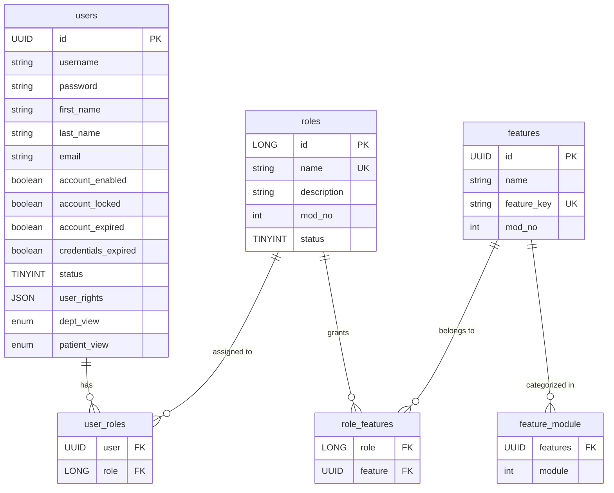
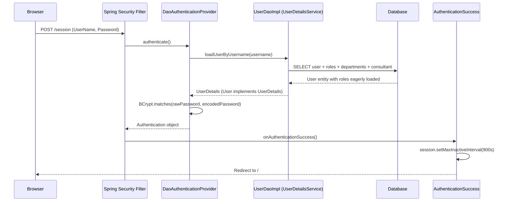
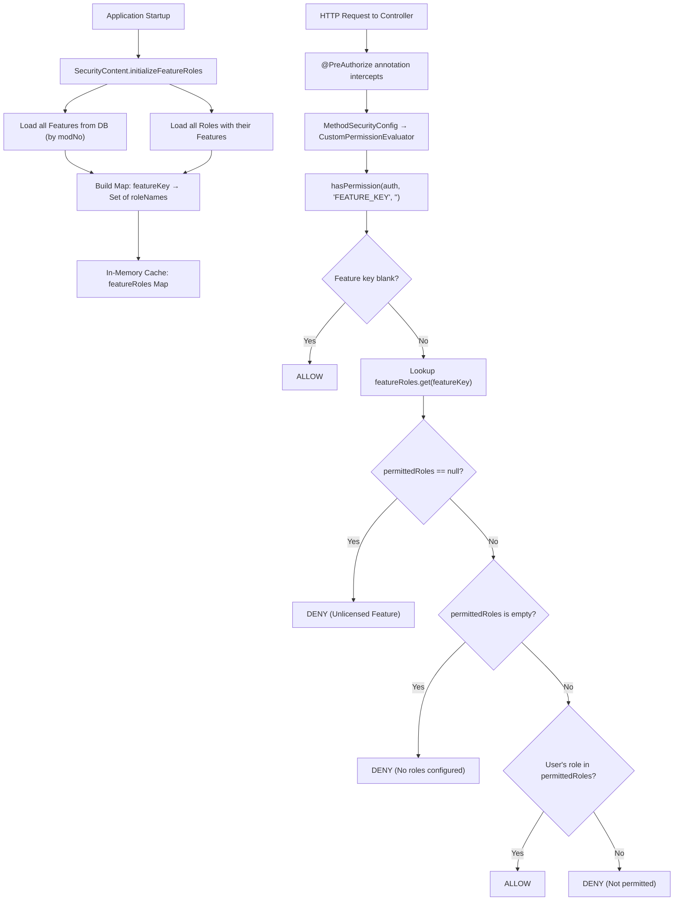
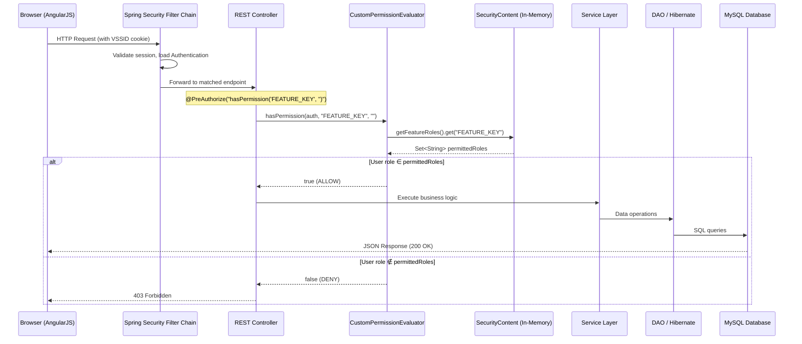

# VitalSoft HIMS — Role-Based Access Control (RBAC) System Documentation

## 1. Executive Summary

The VitalSoft Hospital Information Management System implements a **feature-level RBAC** architecture built on **Spring Security**. Access control is enforced at two layers:

1. **Backend (API layer)** — `@PreAuthorize` annotations with a `CustomPermissionEvaluator` guard every REST endpoint.
2. **Frontend (UI layer)** — The AngularJS client fetches the current user's permitted features and conditionally renders menus and actions.

The system uses three core entities — **User**, **Role**, and **Feature** — connected through join tables, with an in-memory cache (`SecurityContent`) that maps every feature to its permitted roles for fast runtime evaluation.

---

## 2. Core Data Model

### 2.1 Database Tables & Relationships



### 2.2 Entity Descriptions

| Entity | Table | Key Fields | Purpose |
|--------|-------|------------|---------|
| **User** | `users` | `username`, `password`, `status`, `user_rights`, `dept_view` | Represents a system user (receptionist, doctor, admin, etc.) |
| **Role** | `roles` | `name`, `mod_no`, `status` | Named authority (e.g., `ROLE_ADMIN`, `ROLE_DOCTOR`) |
| **Feature** | `features` | `feature_key`, `mod_no`, `modules` | Granular permission unit (e.g., `REGISTRATION`, `PATIENT_BILLS`) |

### 2.3 Seed Roles (from MetaData.sql)

| ID | Role Name | mod_no | Description |
|----|-----------|--------|-------------|
| 1 | `ROLE_SUPER_ADMIN` | 1 | Full system access; hidden from non-SA users |
| 2 | `ROLE_ADMIN` | 1 | Administrative access |
| 3 | `ROLE_USER` | 1 | Basic user |
| 4 | `ROLE_LAB` | 3 | Laboratory technician |
| 5 | `ROLE_BILLING` | 1 | Billing staff |
| 6 | `ROLE_RECEPTION` | 1 | Front desk / Reception |
| 7 | `ROLE_DOCTOR` | 9 | Consulting physician |
| 8 | `ROLE_RADIOLOGY` | 4 | Radiology technician |
| 9 | `ROLE_STOCK` | 13 | Inventory / Stock management |
| 10 | `ROLE_SALES` | 14 | Pharmacy sales |
| 11 | `ROLE_NURSE` | 1 | Nursing staff |

### 2.4 Module Enum

Features are categorized into UI modules via the `Types.Module` enum:

```
RECEPTION, BILLING, DIAGNOSTICS, INVENTORY, CONSULTANT,
ADMIN, MRD, INSURANCE, OTSCHEDULE, BLOODBANK, AMBULANCE,
EQUIPMENT, CSSD
```

---

## 3. Authentication Flow

### 3.1 Spring Security Configuration

File: [SecurityConfig.java](file:///home/ssb/Downloads/HIMS/vitalsoft/application/src/main/java/com/ssb/vitalsoft/config/SecurityConfig.java)

```
Login URL:          POST /session
Login Page:         /login
Success Redirect:   / (always)
Logout URL:         /logout
Session Cookie:     VSSID
CSRF:               Disabled
Password Encoder:   BCryptPasswordEncoder
```

### 3.2 Authentication Pipeline



> [!IMPORTANT]
> The `User` entity implements `UserDetails` and `Role` implements `GrantedAuthority`. This means roles are directly used as Spring Security authorities.

### 3.3 User Loading (UserDaoImpl.loadUserByUsername)

During login, the DAO loads the user with eagerly-fetched associations:
- **Roles** (with `id` and `name`)
- **Departments** (left outer join)
- **Consultant** (left outer join)
- User properties: `password`, `userRights`, `deptView`, `patientView`, etc.

The result is transformed via `AliasToNestedMapResultTransformer` into a fully hydrated `User` object stored in the `SecurityContext`.

---

## 4. Authorization Flow — Backend

### 4.1 Architecture Overview



### 4.2 SecurityContent — The In-Memory Feature-Role Cache

File: [SecurityContent.java](file:///home/ssb/Downloads/HIMS/vitalsoft/application/src/main/java/com/ssb/vitalsoft/config/SecurityContent.java)

At startup, `SecurityContent` builds a `Map<String, Set<String>>`:
- **Key**: Feature key (e.g., `"REGISTRATION"`)
- **Value**: Set of role names permitted to access it (e.g., `{"ROLE_ADMIN", "ROLE_RECEPTION"}`)

```java
// Pseudocode of initializeFeatureRoles()
for each Feature → featureRoles.put(feature.featureKey, emptySet)
for each Role → for each role.feature →
    if featureRoles.containsKey(feature.featureKey)
        featureRoles.get(feature.featureKey).add(role.name)
```

### 4.3 CustomPermissionEvaluator — Runtime Gate

File: [CustomPermissionEvaluator.java](file:///home/ssb/Downloads/HIMS/vitalsoft/application/src/main/java/com/ssb/vitalsoft/config/CustomPermissionEvaluator.java)

Every `@PreAuthorize("hasPermission('FEATURE_KEY', '')")` call is routed here:

1. Extract user's roles from `Authentication.getAuthorities()`
2. If feature name is blank → **Allow**
3. Lookup `securityContent.getFeatureRoles().get(featureName)`
4. If `null` → **Deny** (unlicensed feature)
5. If empty set → **Deny** (no roles configured)
6. If any user role exists in the permitted set → **Allow**
7. Otherwise → **Deny** (log: IP, username, feature name)

### 4.4 MethodSecurityConfig — Wiring It All Together

File: [MethodSecurityConfig.java](file:///home/ssb/Downloads/HIMS/vitalsoft/application/src/main/java/com/ssb/vitalsoft/config/MethodSecurityConfig.java)

```java
@EnableGlobalMethodSecurity(securedEnabled = true, prePostEnabled = true)
public class MethodSecurityConfig extends GlobalMethodSecurityConfiguration {
    @Bean
    public PermissionEvaluator permissionEvaluator() {
        return new CustomPermissionEvaluator();
    }
    @Override
    protected MethodSecurityExpressionHandler createExpressionHandler() {
        handler.setPermissionEvaluator(permissionEvaluator());
        return handler;
    }
}
```

### 4.5 SecurityAspect — Auto-Refresh on Role Changes

File: [SecurityAspect.java](file:///home/ssb/Downloads/HIMS/vitalsoft/application/src/main/java/com/ssb/vitalsoft/aspect/SecurityAspect.java)

An AOP `@AfterReturning` advice watches `RoleManagerImpl.save*()`, `update*()`, and `remove*()`. After any role mutation, it calls `securityContent.initializeFeatureRoles()` to rebuild the cache **without requiring a server restart**.

### 4.6 PermissionUtil — Programmatic Access Checks

File: [PermissionUtil.java](file:///home/ssb/Downloads/HIMS/vitalsoft/application/src/main/java/com/ssb/vitalsoft/util/PermissionUtil.java)

For service-layer permission checks (not annotation-driven):

```java
@Component
public class PermissionUtil {
    public boolean hasPermission(String featureName) {
        Set<String> permittedRoles = securityContent.getFeatureRoles().get(featureName);
        if (permittedRoles == null || permittedRoles.isEmpty()) return false;
        Set<String> roles = getUserRoles();
        for (String role : roles)
            if (permittedRoles.contains(role)) return true;
        return false;
    }
}
```

---

## 5. Feature-to-Controller Mapping

Every protected endpoint uses `@PreAuthorize("hasPermission('FEATURE_KEY', '')")`. Below is the complete mapping:

### 5.1 Settings Module

| Feature Key | Controller | Protected Operations |
|-------------|-----------|---------------------|
| `SETTINGS_ROLE` | `RoleController` | Create/Update roles |
| `SETTINGS_ROLE` | `FeatureController` | List all features |
| `SETTINGS_USERS` | `UserController` | List/Create/Update users, reset passwords |
| `SETTINGS_HOSPITALPROFILE` | `HospitalProfileController` | View/Update hospital profile |
| `SETTINGS_CONFIGURATION` | `ConfigurationController` | View/Update system config |
| `SETTINGS_PREFIX` | `PrefixController` | All prefix operations |
| `SETTINGS_CHARGES` | `ChargeController` | CRUD charge items |
| `SETTINGS_CONSULTANT` | `AppointmentSlotController` | Manage appointment slots |
| `SETTINGS_CONSULTANT_REVENUESHARE` | `ConsultantShareController` | All revenue share ops |
| `SETTINGS_PAYERTYPE` | `PayorController` | Create/Update payer types |
| `SETTINGS_BEDTYPE` | `BedTypeController` | Manage bed types |
| `SETTINGS_BED` | `BedController` | CRUD bed definitions |
| `SETTINGS_FREQUENCY` | `FrequencyController` | Manage frequencies |

### 5.2 Clinical / Operations Module

| Feature Key | Controller | Protected Operations |
|-------------|-----------|---------------------|
| `REGISTRATION` | `PatientController` | Patient registration & search |
| `APPOINTMENT` | `AppointmentController` | Appointment booking |
| `PATIENT_BILLS` | `ChargeController`, `DiagnosticController` | Bill-related charge ops |
| `PAYMENT` | `PaymentController` | All payment operations |
| `IN_PATIENT` | `AppointmentSlotController` | IP slot queries |
| `BEDMANAGEMENT` | `BedController` | Bed allocation/transfer/discharge |
| `OT_SCHEDULE` | `ChargeController` | OT-related charges |
| `MARKETING` | `CampaignController` | Campaign management |

### 5.3 Diagnostics Module

| Feature Key | Controller | Protected Operations |
|-------------|-----------|---------------------|
| `LAB_REPORT` | `DiagnosticController`, `DiagnosticReportController` | Lab orders & reports |
| `RADIOLOGY` | `DiagnosticController`, `DiagnosticReportController` | Radiology orders & reports |
| `MEDICAL_RECORD` | `DiagnosticReportController`, `DiagnosticController`, `ChargeController` | MRD access to reports/charges |

> [!NOTE]
> Some endpoints accept **multiple features** with `OR` logic, e.g.:
> `@PreAuthorize("hasPermission('LAB_REPORT', '') OR hasPermission('RADIOLOGY', '')")`
> This allows shared endpoints to be accessed by either Lab or Radiology roles.

---

## 6. Authorization Flow — Frontend

### 6.1 Feature Loading on Login

File: [main.js](file:///home/ssb/Downloads/HIMS/vitalsoft/application/src/main/webapp/app/modules/main.js)

After login, the frontend:

1. Calls `GET /user/loggedInUser` to get the full user object (with roles and features)
2. Iterates roles → features and builds `$scope.features[featureKey] = true`
3. Uses `$scope.features` to conditionally show/hide UI elements via `ng-if`/`ng-show`

```javascript
// main.js lines 119-127
$scope.features = [];
var roles = loggedInUser.roles;
angular.forEach(roles, function(role) {
    $scope.metaUserRoles.push(role.name);
    angular.forEach(role.features, function(feature) {
        $scope.features[feature.featureKey] = true;
    });
});
```

### 6.2 Module-Specific Feature Filtering

When a user clicks a module (e.g., BILLING), the frontend calls:

```
GET /feature/getFeaturesByCurrentUser?module=BILLING
```

The backend (`FeatureServiceImpl.getFeaturesByCurrentUser`) returns a `Map<String, Boolean>` of feature keys the user has access to **within that module**. The frontend replaces `$scope.features` with this filtered map.

### 6.3 Role-Based Dashboard Routing

On initial load, the frontend routes users to role-appropriate default views:

| Role | Default Path |
|------|-------------|
| `ROLE_SUPER_ADMIN` | `/reports` |
| `ROLE_DOCTOR` | `/outpatient` |
| `ROLE_LAB` | `/diagnostics` |
| `ROLE_RADIOLOGY` | `/radiology` |
| `ROLE_RECEPTION` | `/patient` |
| `ROLE_BILLING` | `/search` |
| `ROLE_ADMIN` | `/module` or `/reports` |

---

## 7. User Management & Security

### 7.1 UserSecurityAdvice — Preventing Privilege Escalation

File: [UserSecurityAdvice.java](file:///home/ssb/Downloads/HIMS/vitalsoft/application/src/main/java/com/ssb/vitalsoft/aspect/UserSecurityAdvice.java)

An AOP advice wrapping `UserManager.save*()` methods enforces:

1. **Only admins can modify other users** — Non-admins attempting to edit another user's record get `AccessDeniedException`
2. **Users cannot change their own roles** — If a non-admin tries to save themselves with different roles, access is denied
3. **Session refresh** — After a successful self-update, the `SecurityContext` is refreshed with the updated user object

### 7.2 Super Admin Isolation

The `ROLE_SUPER_ADMIN` role is treated specially:

- **User listing**: `UserManagerImpl.getAllUsers()` filters out SA users when the requester is not SA
- **Role listing**: `RoleDaoImpl.getRolesByModNo()` excludes `ROLE_SUPER_ADMIN` for non-SA users
- **Detection**: `CommonUtil.hasSARole()` checks for the `ROLE_SUPER_ADMIN` constant
- **Auto dept-view**: Users with `ROLE_ADMIN` or `ROLE_SUPER_ADMIN` get `DeptView = AllRecord`

### 7.3 Additional User-Level Controls

| Field | Purpose |
|-------|---------|
| `user_rights` (JSON) | Fine-grained clinical permissions (e.g., can add prescriptions, diagnostics, attachments) |
| `dept_view` | Data visibility scope: `AllRecord`, `OnlyHisDepartmentRecord`, `OnlyHisRecord` |
| `patient_view` | Patient list filter: `DepartmentWise` or `ConsultantWise` |
| `account_locked` | Auto-locked when status set to `inactive` |
| `account_enabled` | Must be `true` for login; set on creation |

---

## 8. Complete Request Lifecycle



---

## 9. Key Design Decisions

### 9.1 In-Memory Caching
The `featureRoles` map is loaded once at startup and refreshed only when roles are modified (via `SecurityAspect`). This avoids database lookups on every API call, providing **O(1) authorization checks**.

### 9.2 Feature-Level (Not Role-Level) Guards
Controllers check **features**, not roles. This means:
- Adding a new role requires only mapping it to existing features in the database
- No code changes needed for new roles
- Features provide finer granularity than role-based checks

### 9.3 Dual-Layer Enforcement
- **Backend**: `@PreAuthorize` ensures API-level security (cannot be bypassed)
- **Frontend**: Feature flags hide unauthorized UI elements for a clean UX

### 9.4 Module-Based Licensing
Features have a `mod_no` field linking to licensed modules. `SecurityContent.getModNos()` returns modules 1–32 (bypassing license validation in this build). Only features whose `mod_no` is in the licensed set are loaded into the cache.

---

## 10. File Reference Index

| Component | File Path |
|-----------|-----------|
| User Entity | [User.java](file:///home/ssb/Downloads/HIMS/vitalsoft/application/src/main/java/com/ssb/vitalsoft/model/User.java) |
| Role Entity | [Role.java](file:///home/ssb/Downloads/HIMS/vitalsoft/application/src/main/java/com/ssb/vitalsoft/model/Role.java) |
| Feature Entity | [Feature.java](file:///home/ssb/Downloads/HIMS/vitalsoft/application/src/main/java/com/ssb/vitalsoft/model/Feature.java) |
| Security Config | [SecurityConfig.java](file:///home/ssb/Downloads/HIMS/vitalsoft/application/src/main/java/com/ssb/vitalsoft/config/SecurityConfig.java) |
| Method Security | [MethodSecurityConfig.java](file:///home/ssb/Downloads/HIMS/vitalsoft/application/src/main/java/com/ssb/vitalsoft/config/MethodSecurityConfig.java) |
| Permission Evaluator | [CustomPermissionEvaluator.java](file:///home/ssb/Downloads/HIMS/vitalsoft/application/src/main/java/com/ssb/vitalsoft/config/CustomPermissionEvaluator.java) |
| Feature-Role Cache | [SecurityContent.java](file:///home/ssb/Downloads/HIMS/vitalsoft/application/src/main/java/com/ssb/vitalsoft/config/SecurityContent.java) |
| Cache Refresh Aspect | [SecurityAspect.java](file:///home/ssb/Downloads/HIMS/vitalsoft/application/src/main/java/com/ssb/vitalsoft/aspect/SecurityAspect.java) |
| User Security Advice | [UserSecurityAdvice.java](file:///home/ssb/Downloads/HIMS/vitalsoft/application/src/main/java/com/ssb/vitalsoft/aspect/UserSecurityAdvice.java) |
| Permission Utility | [PermissionUtil.java](file:///home/ssb/Downloads/HIMS/vitalsoft/application/src/main/java/com/ssb/vitalsoft/util/PermissionUtil.java) |
| Auth Success Handler | [AuthenticationSuccess.java](file:///home/ssb/Downloads/HIMS/vitalsoft/application/src/main/java/com/ssb/vitalsoft/config/AuthenticationSuccess.java) |
| Role Controller | [RoleController.java](file:///home/ssb/Downloads/HIMS/vitalsoft/application/src/main/java/com/ssb/vitalsoft/controller/RoleController.java) |
| Feature Controller | [FeatureController.java](file:///home/ssb/Downloads/HIMS/vitalsoft/application/src/main/java/com/ssb/vitalsoft/controller/FeatureController.java) |
| User Controller | [UserController.java](file:///home/ssb/Downloads/HIMS/vitalsoft/application/src/main/java/com/ssb/vitalsoft/controller/UserController.java) |
| Role Manager | [RoleManagerImpl.java](file:///home/ssb/Downloads/HIMS/vitalsoft/application/src/main/java/com/ssb/vitalsoft/service/impl/RoleManagerImpl.java) |
| User Manager | [UserManagerImpl.java](file:///home/ssb/Downloads/HIMS/vitalsoft/application/src/main/java/com/ssb/vitalsoft/service/impl/UserManagerImpl.java) |
| Feature Service | [FeatureServiceImpl.java](file:///home/ssb/Downloads/HIMS/vitalsoft/application/src/main/java/com/ssb/vitalsoft/service/impl/FeatureServiceImpl.java) |
| User DAO | [UserDaoImpl.java](file:///home/ssb/Downloads/HIMS/vitalsoft/application/src/main/java/com/ssb/vitalsoft/dao/impl/UserDaoImpl.java) |
| Role DAO | [RoleDaoImpl.java](file:///home/ssb/Downloads/HIMS/vitalsoft/application/src/main/java/com/ssb/vitalsoft/dao/impl/RoleDaoImpl.java) |
| Constants | [Constants.java](file:///home/ssb/Downloads/HIMS/vitalsoft/application/src/main/java/com/ssb/vitalsoft/constants/Constants.java) |
| Types/Enums | [Types.java](file:///home/ssb/Downloads/HIMS/vitalsoft/application/src/main/java/com/ssb/vitalsoft/constants/Types.java) |
| Frontend Main | [main.js](file:///home/ssb/Downloads/HIMS/vitalsoft/application/src/main/webapp/app/modules/main.js) |
| Seed Data | [MetaData.sql](file:///home/ssb/Downloads/HIMS/vitalsoft/application/src/main/resources/MetaData.sql) |
